# KAMP 프레스 유압펌프 데이터 분석 요약

- 실행 시각: 2026-10-03 19:46
- 입력 데이터: `press_data_normal.csv`, `outlier_data.csv`
- 결과 폴더: `결과/20261003_194353_525477`

## 1. 한눈에 보기

- **데이터**: 정상 19,999행, 이상 600행입니다. 정상은 2022-07-12, 이상은 2022-07-17에 기록되어 **측정 날짜가 다릅니다.**
- **기록 주기**: 기본 100 ms(10 Hz)입니다. 중간중간 기록이 멈췄다가 새로 시작해서, 끊김 없이 이어진 **구간** 단위로 나눠 분석합니다.
- **끊김 기준**: 100 ms 초과 ~ 1545 ms 미만이면 어떤 값을 골라도 결과가 같습니다. 현재 기준은 150 ms입니다.
- **가장 좋은 기준 모델**: E2_time_psd_W20입니다. Test F1 0.92, AP 0.98, 정상 오탐률 0.75%입니다.
- **가장 단순한 규칙(E0)**: Test F1 0.48입니다. 시간 창과 주파수 특징을 쓰면 크게 좋아집니다.
- **파형 모양**: RMS와 P2P의 정상 관계에서 벗어난 정도만으로도 Valid 구분력(AUC)이 AI2_Current에서 0.92입니다.

## 2. 데이터와 시간 간격

| 데이터 | 행 수 | 기록 기간 | 정확히 100 ms 간격 | 끊김 수 | 끊김 길이(초) | 구간 수 | 가장 긴 구간(행) |
|---|---|---|---|---|---|---|---|
| 정상 | 19,999 | 2022-07-12 00:00 ~ 01:16 | 97.0% | 598 | 1.5 ~ 16.6 | 599 | 50 |
| 이상 | 600 | 2022-07-17 10:51 ~ 10:53 | 96.7% | 20 | 1.8 ~ 8.6 | 21 | 50 |

- **interval(간격)**: 바로 앞 기록과의 시간 차이입니다.
- **gap(끊김)**: 간격이 150 ms보다 긴 곳입니다.
- **segment(구간)**: 끊김 없이 이어진 기록 덩어리입니다. 윈도는 구간 안에서만 자릅니다.
- 끊김 길이가 100 ms 배수에 맞지 않고 구간마다 박자 위치가 달라서, 샘플 몇 개가 빠진 것이 아니라 **기록 재시작**으로 봅니다. 그래서 끊긴 곳을 보간으로 채우지 않습니다.

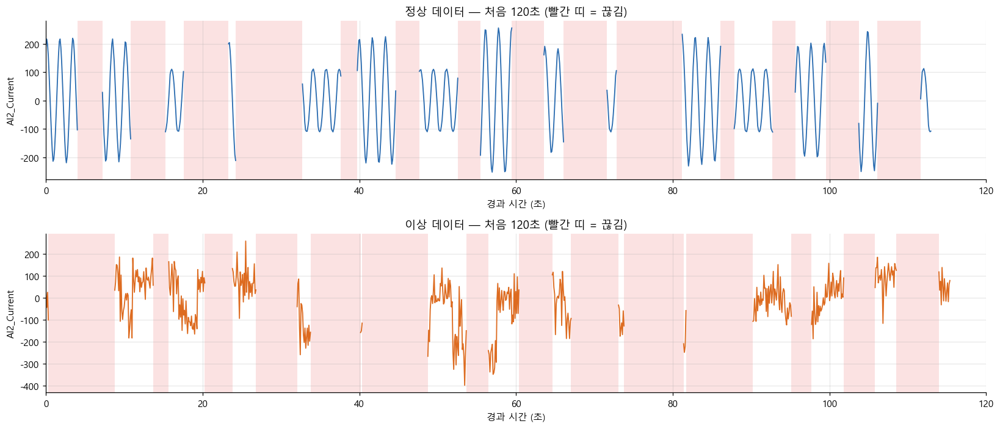

*앞부분 전류 파형과 끊김(빨간 띠)*

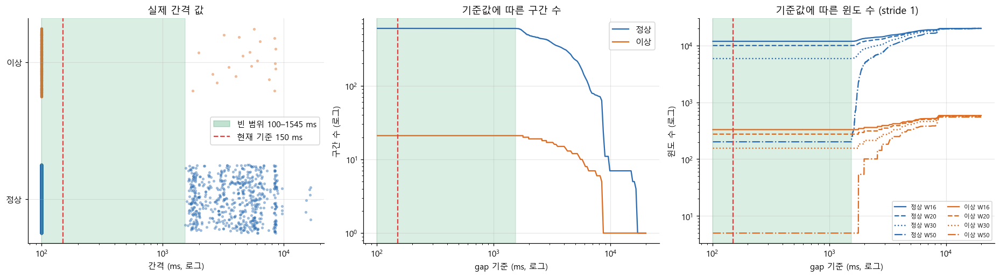

*gap 기준값에 따른 구간·윈도 수 (초록 띠 안에서는 결과가 같음)*

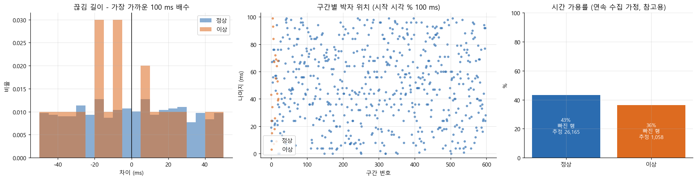

*끊김이 샘플 누락이 아니라 기록 재시작이라는 근거*

## 3. Train / Valid / Test 분할

| 데이터 | split | 행 | 행 비율 | 구간 | 시간 |
|---|---|---|---|---|---|
| 정상 | train | 12,012 | 60% | 360 | 07-12 00:00:00 ~ 00:45:07 |
| 정상 | valid | 3,997 | 20% | 121 | 07-12 00:45:10 ~ 01:01:01 |
| 정상 | test | 3,990 | 20% | 118 | 07-12 01:01:04 ~ 01:16:55 |
| 이상 | valid | 280 | 47% | 11 | 07-17 10:51:07 ~ 10:52:29 |
| 이상 | test | 320 | 53% | 10 | 07-17 10:52:38 ~ 10:53:53 |

| 규칙 | 이유 |
|---|---|
| 구간을 통째로 한 분할에 | 이웃 윈도가 거의 같아서, 섞으면 같은 윈도가 Train과 Test에 함께 들어가 성능이 부풀려집니다. |
| 시간 순서대로 | 과거로 학습하고 미래로 평가하는 현장 상황과 같게 합니다. |
| 이상은 Train에 없음 | 이상이 600행뿐이라 정상만 학습하고, 정상에서 벗어난 정도로 이상을 찾습니다. |
| 정상 Valid | 임계값을 정상 오탐률 1%로 정하는 데 씁니다. |
| 이상 Valid/Test 반씩 | Test는 마지막에 한 번만 성능을 잽니다. |

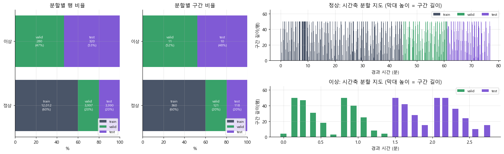

*구간 단위 Train/Valid/Test 분할과 시간축 분할 지도*

## 4. 윈도

윈도는 구간 안에서 W행씩 한 칸씩 밀며 자른 묶음입니다. 윈도마다 RMS, P2P 같은 시간 특징과 FFT/PSD 주파수 특징을 계산합니다.

| 데이터 | W16 | W20 | W30 | W50 |
|---|---|---|---|---|
| 정상 | 11,840 | 9,978 | 5,893 | 202 |
| 이상 | 331 | 276 | 156 | 5 |

구간이 최대 50행(5초)이라 윈도가 길수록 쓸 수 있는 구간이 줄어듭니다.

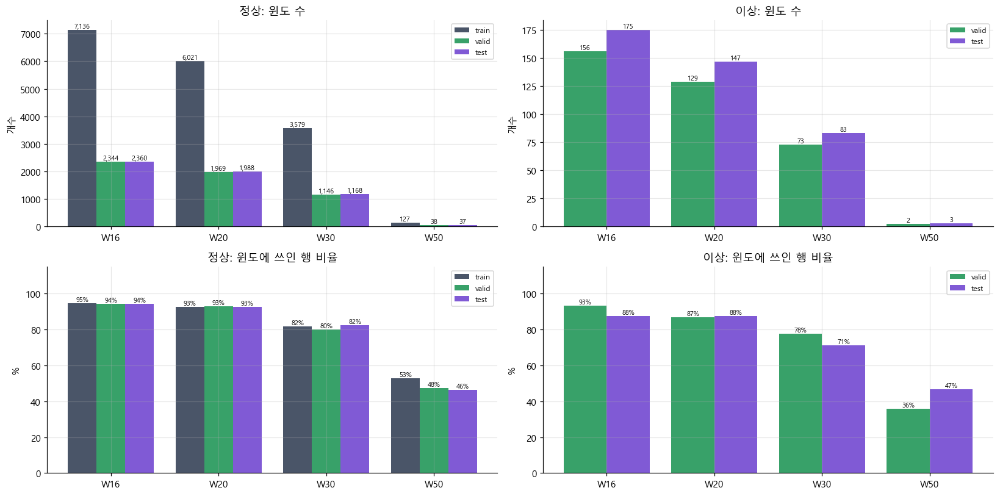

*윈도 길이별 윈도 수와 행 활용률*

## 5. 기준 모델 성능 (Test, 정상 오탐률 1% 정책)

| 실험 | 내용 |
|---|---|
| E0_abs_OR | 행 하나의 센서 절댓값 규칙. 학습 없음 |
| E1_time_W20 | W20 시간 특징 + Isolation Forest |
| E2_time_psd_W20 | W20 시간 + 주파수 특징 + Isolation Forest |
| E3_time_W16 / W30 | W16·W30 시간 특징 + Isolation Forest |

모두 이 노트북이 정상 Train으로 직접 학습한 비교용 모델입니다. 실험마다 판정 시점 수가 달라서 TP, FP 개수는 직접 비교하지 말고 비율을 보세요.

| 실험 | 정밀도 | 재현율 | F1 | AP | 정상 오탐률 | 맞힌 이상(TP) | 오탐(FP) | 미탐(FN) |
|---|---|---|---|---|---|---|---|---|
| E0_abs_OR | 0.981 | 0.319 | 0.481 | 0.561 | 0.05% | 102 | 2 | 218 |
| E1_time_W20 | 0.889 | 0.762 | 0.821 | 0.892 | 0.70% | 112 | 14 | 35 |
| E2_time_psd_W20 | 0.902 | 0.939 | 0.920 | 0.983 | 0.75% | 138 | 15 | 9 |
| E3_time_W16 | 0.847 | 0.726 | 0.782 | 0.872 | 0.97% | 127 | 23 | 48 |
| E3_time_W30 | 0.941 | 0.771 | 0.848 | 0.859 | 0.34% | 64 | 4 | 19 |

**구간 단위로 본 경보** (현장에서는 "그 구간에 경보가 울렸는가"가 더 중요합니다)

| 실험 | 이상 구간 중 경보가 1번이라도 울린 구간 | 정상 구간 중 경보가 1번이라도 울린 구간 |
|---|---|---|
| E0_abs_OR | 9 / 10 | 2 / 118 |
| E1_time_W20 | 7 / 7 | 4 / 90 |
| E2_time_psd_W20 | 7 / 7 | 1 / 90 |
| E3_time_W16 | 7 / 7 | 6 / 94 |
| E3_time_W30 | 5 / 5 | 1 / 73 |

윈도 모델은 윈도 길이보다 짧은 구간을 판정하지 못합니다. 예를 들어 이상 Test 10구간 중 20행 이상인 구간은 7개라서, W20 모델의 분모가 7입니다. 짧은 구간까지 다루려면 E0 같은 행 단위 규칙과 함께 써야 합니다.

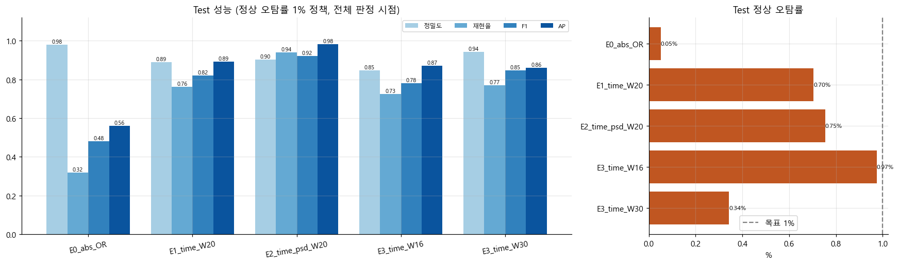

*Test 성능과 정상 오탐률*

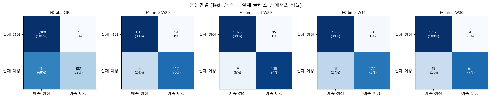

*Test 혼동행렬*

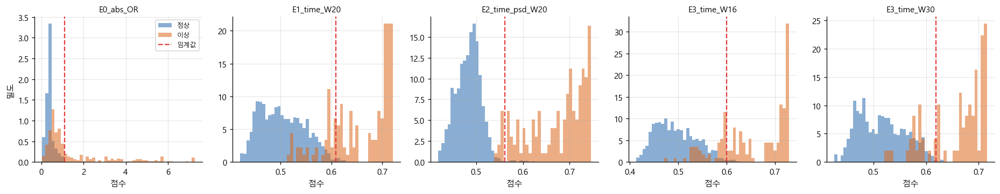

*Test 점수 분포와 임계값*

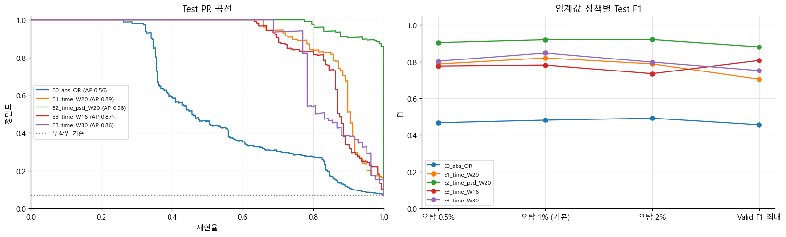

*PR 곡선과 임계값 정책별 F1*

## 6. 오류 (오탐·미탐)

| 실험 | 오탐 FP (정상→이상) | 미탐 FN (이상→정상) |
|---|---|---|
| E0_abs_OR | 2 | 218 |
| E1_time_W20 | 14 | 35 |
| E2_time_psd_W20 | 15 | 9 |
| E3_time_W16 | 23 | 48 |
| E3_time_W30 | 4 | 19 |

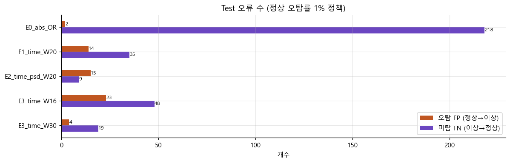

*Test 오탐·미탐 수*

## 7. 그래프 읽는 법

**스펙트럼 범례 `State 0; 165 segments`**

State 0은 정상, State 1은 이상입니다. 숫자는 그 선을 그리는 데 쓴 구간 수입니다.
스펙트럼은 Train+Valid만 쓰고, 윈도 길이 N 이상 끊김 없이 이어진 구간에서만 계산합니다.

| 데이터 | W16 | W20 | W30 | W50 |
|---|---|---|---|---|
| 정상 (State 0) | 379 | 362 | 287 | 165 |
| 이상 (State 1) | 7 | 6 | 5 | 2 |

이상 데이터는 50행짜리 구간이 2개뿐입니다. 그래서 N=50 이상 스펙트럼은 근거가 약하고, W20 결과를 주로 봅니다.

**RMS–P2P 산점도**

RMS는 평균 세기, P2P는 최댓값과 최솟값의 차이입니다. 파형 모양이 일정하면 둘이 비례해서 정상 점이 한 줄의 띠를 이룹니다.
이상 점이 띠에서 벗어나면 세기가 아니라 파형 모양이 바뀐 것입니다. 가로로 늘어선 점은 큰 튐 하나가 여러 윈도에 걸친 경우입니다.

| 센서 | RMS만 | P2P만 | 띠에서 벗어난 정도 |
|---|---|---|---|
| AI0_Vibration | 0.912 | 0.875 | 0.917 |
| AI1_Vibration | 0.889 | 0.823 | 0.910 |
| AI2_Current | 0.584 | 0.598 | 0.921 |

구분력(AUC)은 0.5면 못 가르고 1이면 완벽하게 가릅니다. 정상 Train으로 띠를 맞추고 Valid에서 쟀습니다.

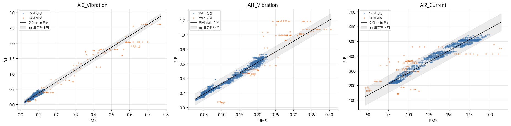

*RMS–P2P 정상 띠와 Valid 점 (띠에서 벗어나면 파형 모양이 바뀐 것)*

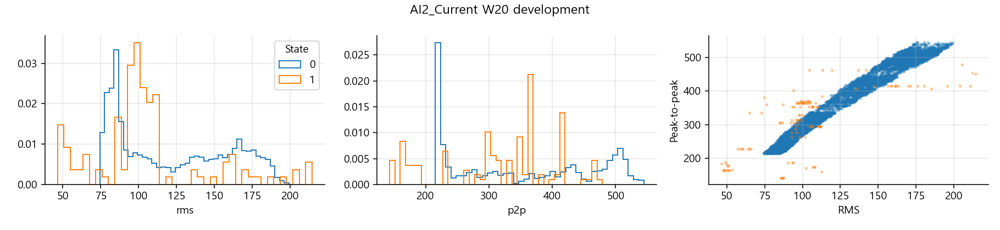

*AI2_Current: RMS·P2P 분포와 산점도 (원본 그림)*

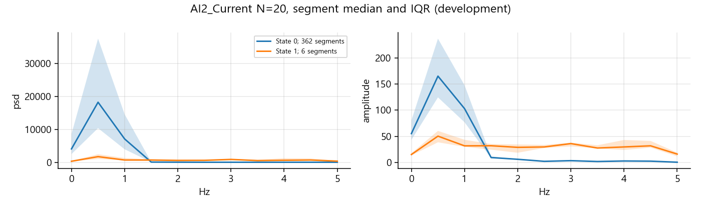

*AI2_Current: W20 스펙트럼 (원본 그림)*

**주파수(FFT/PSD)**: 10 Hz 샘플링이라 0–5 Hz만 볼 수 있습니다. 그보다 빠른 진동은 낮은 주파수로 섞여 보입니다. 그래서 이 결과로 베어링이나 기어 같은 부품 고장 주파수를 진단하지 않습니다.

## 8. 주의할 점

- **날짜 차이**: 정상과 이상의 측정 날짜가 달라서, 모델이 고장이 아니라 날짜나 운전 조건 차이를 배웠을 수 있습니다. 데이터로는 분리할 수 없으니 보고서에 한계로 적어야 합니다.
- **조기탐지 검증 불가**: 라벨이 파일 단위로 고정이고 정상에서 이상으로 바뀌는 순간이 없습니다. "몇 초 먼저 잡았다"는 이 데이터로 잴 수 없습니다.
- **독립 사례 수**: 겹치는 윈도는 독립 사례가 아닙니다. 이상 구간은 21개뿐이라 F1 같은 점수의 편차가 큽니다.
- **Test 재사용**: 오류를 보고 모델이나 임계값을 고치면 같은 Test는 더 이상 최종 검증이 아닙니다.
- **누락 추정**: 시간 가용률은 연속 수집을 가정한 참고값입니다.
- **센서 단위**: 진동과 전류의 단위와 설치 위치가 문서로 확인되지 않아 절대값 기준을 현장 기준으로 바로 쓰기 어렵습니다.

## 9. 결과 파일

| 파일 | 내용 |
|---|---|
| `notebook_figures/`, `figures/` | 그래프 |
| `metrics.csv`, `thresholds.csv` | 성능과 임계값 |
| `predictions.csv`, `error_cases.csv`, `segment_predictions.csv` | 판정 근거와 오류 사례 |
| `segment_summary.csv`, `split_manifest.csv` | 구간과 분할 |
| `window_features.csv` | 윈도 특징 |
| `report.txt` | 원본 형식 보고서 |
