# KAMP 데이터 분석 요약 v4_1 (Train·Valid만 사용)

- 실행 시각: 2026-10-04 05:55
- 입력 데이터: `~/Desktop/KAMP/main_project/ipynb_experiments_colab_stable_v5`
- **방식**: 공백을 고려합니다. 끊김으로 나눈 구간 단위로 분할하고, 구간 안에서만 윈도를 만듭니다.
- 설정: 정상 7:1:2, 이상 0:1:2, 윈도 20행(2초), 라벨 윈도 마지막 행, 부호를 유지한 값
- 분석 범위: 이 노트북은 **Train과 Valid만** 씁니다. Test는 분할 직후 따로 떼어 두었습니다.
- 공식 분할: v4_1, v4_2, v4_3 중 하나를 나중에 공식 분할로 정합니다. 이 폴더의 결과는 그 전까지 비교용입니다.

## 1. 한눈에 보기

- **Train/Valid/Test 분리 점검**: 모든 점검을 통과했습니다.
- **끊김 구조**: 정상 Train+Valid는 간격의 97.0%가 정확히 100 ms이고, 끊김 480개(길이 중앙값 4.2초)로 구간 481개(길이 중앙값 37행)로 나뉩니다. 끊김 길이가 100 ms 배수에서 ±5 ms 이내인 비율은 12%, 구간 박자 위치의 표준편차는 28 ms라 샘플 몇 개가 빠진 것이 아니라 **기록이 멈췄다가 새 박자로 다시 시작**된 것으로 보입니다. 끊김 기준을 안전 범위(100~1553 ms) 안에서 바꿔도 정상 Train 기간의 구간 수가 423개로 같습니다.
- **이상 근거**: 이상 Valid는 원본 203행, 구간 7개입니다. 윈도가 닿는 구간은 4개, 판정 단위 구간은 4개이고, 입력에 안 쓰인 행은 12.3%입니다.
- **가장 잘 가르는 변수**: `AI2_band_high` (주파수, 이상에서 큼), Valid AUC 1.000 (95% 구간 1.00~1.00, 참고용 (이상 구간 4개))입니다.
- **분류별로는** 시간 변화 변수가 가장 강합니다(최고 AUC 1.000). 가장 약한 분류는 크기입니다(최고 0.909).
- **중복과 VIF**: 변수 62개는 상관 0.9 이상끼리 묶으면 42개 묶음입니다. VIF가 10을 넘는 변수가 40개이고, 대표 변수 10개는 모두 VIF 5 이하입니다(최대 3.66).
- **고윳값**: 정상 변동의 95%를 주성분 23개로 설명합니다. 고윳값 1을 넘는 주성분은 14개입니다. 고윳값 기반 점수 중 Hotelling T²의 Valid AUC가 1.000입니다.
- **분리 여유** (이상 하위 5% 점수 ÷ 임계값, 클수록 여유): 단일 변수 95.13, 대표 변수 마할라노비스 거리² 4712.10, PCA Hotelling T² 2276.98, PCA SPE (Q) 8424.31
- **정상 구간 오경보** (정상 Valid 구간 중 경보가 한 번이라도 울린 구간): 단일 변수 4 / 46, 대표 변수 마할라노비스 거리² 5 / 46, PCA Hotelling T² 6 / 46, PCA SPE (Q) 5 / 46
- **선택 낙관도**: Valid 한쪽 절반에서 다시 고른 후보의 AUC가 다른 절반에서 평균 +0.000 바뀝니다. PCA 점수는 Valid로 고르는 부분이 없어 선택 낙관이 생기지 않습니다.
- **RMS–P2P 관계**: 전류는 RMS만으로 AUC 0.51, P2P만으로 0.51이지만, RMS–P2P 정상 띠에서 벗어난 정도로는 0.92입니다. 이상은 세기보다 파형 모양이 바뀐 것입니다.
- **센서 간 관계** (피어슨, 구간마다 평균 제거): 상관이 가장 크게 바뀐 쌍은 AI0-AI1입니다. 정상 +0.39에서 이상 -0.44로 바뀝니다.
- **시간 구조**: 정상 신호는 AI0 약 0.6초, AI1 약 0.6초, AI2 약 1.6초 주기로 반복합니다. 이상에서는 AI0의 0.1초 뒤 자기상관이 0.03에서 0.71로 바뀝니다. 10 Hz 샘플링이라 이 주기가 실제 느린 반복인지, 더 빠른 진동이 겹쳐 보이는 것(에일리어싱)인지는 이 데이터만으로 구분할 수 없습니다.
- **드리프트**: 정상 Train과 정상 Valid 사이에 `AI0_max_abs`의 분포 차이가 가장 큽니다(KS 0.22).
- **공백 관련**: 재시작 직후 효과: 변수 62개 모두 구간 첫 윈도와 1초 이후의 차이가 IQR의 0.5배 이내라 효과가 거의 없습니다.

## 2. Train / Valid / Test 분리 점검표

✔ 통과, ℹ 참고, ✘ 실패입니다.

| 점검 항목 | 결과 | 설명 |
|---|---|---|
| 끊김 기준을 Train 기간 간격으로만 확인 | ✔ | Train 기간 안전 범위 100~1553 ms, 기준 150 ms |
| 시간 순서 Train < Valid < Test | ✔ | 과거로 학습하고 미래로 평가 |
| 이상 데이터는 Train에 없음 | ✔ | 정상만 학습 |
| 행은 분할끼리 겹치지 않음 | ✔ | 원본 행 하나는 한 분할에만 속함 |
| 분할 경계가 연속 기록을 자르지 않음 | ✔ | 끊긴 곳에서만 나눔 |
| 분석용 데이터에서 Test 행 제거 | ✔ | Test 4,387행은 따로 보관하고 분석에 쓰지 않음 |
| 윈도는 분할 경계를 넘지 않음 | ✔ | 윈도를 블록(구간 또는 분할) 안에서만 자름 |
| 경계 앞뒤 입력이 서로 다른 연속 기록 | ✔ | 경계 앞뒤 입력이 모두 다른 구간에 속함 |
| VIF는 정상 Train으로만 계산 | ✔ | 대표 변수 10개, 최대 VIF 3.66 (상한 5) |
| 표준화·결측 대치·PCA·공분산은 정상 Train으로만 계산 | ✔ | 학습에 쓴 윈도 수와 평균을 다시 계산해 정상 Train 7,005개와 일치 확인 |
| 변수 선택·임계값은 Valid까지만 사용 | ✔ | 임계값을 정상 Valid 상위 1%로 다시 계산해 일치, 윈도에 Test 없음 |

## 3. 데이터와 분할

| 데이터 | 원본 행 | 중복 제거 후 | 결측 칸 | 무한대 칸 | 시간 해석 실패 | 시간 역순 | 라벨 이상 | 중복 행 | 구간 수 | 가장 긴 구간(행) | 기간 |
|---|---|---|---|---|---|---|---|---|---|---|---|
| 정상 | 20,000 | 19,999 | 0 | 0 | 0 | 0 | 0 | 1 | 599 | 50 | 2022-07-12 00:00 ~ 01:16 |
| 이상 | 600 | 600 | 0 | 0 | 0 | 0 | 0 | 0 | 21 | 50 | 2022-07-17 10:51 ~ 10:53 |

끊김 기준은 정상 Train 기간의 간격만으로 확인했습니다. 안전 범위는 100~1553 ms이고 현재 기준은 150 ms입니다.

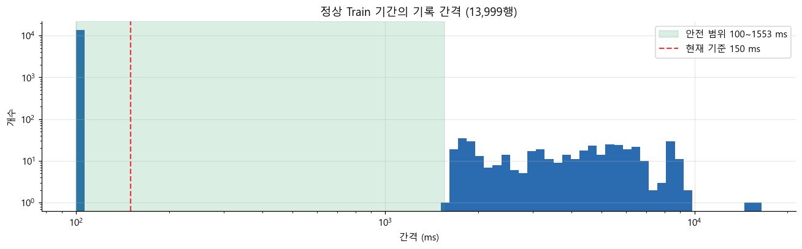

*끊김 기준 점검: 정상 Train 기간의 간격만 사용*

**끊김 기준 민감도**: 끊김 기준을 안전 범위(100~1553 ms) 안에서 바꿔도 정상 Train 기간의 구간 수가 423개로 같습니다.

*끊김 기준값에 따른 구간 수, 구간 안 윈도 수, 이어 붙인 윈도의 끊김 비율 (정상 Train 기간, 초록 = 안전 범위)*

| 데이터 | split | 행 | 행 비율 | 구간(걸친 것 포함) | 시간 |
|---|---|---|---|---|---|
| 정상 | train | 14,023 | 70.1% | 423 | 07-12 00:00:00 ~ 00:53:17 |
| 정상 | valid | 1,986 | 9.9% | 58 | 07-12 00:53:19 ~ 01:01:01 |
| 정상 | test | 3,990 | 20.0% | 118 | 07-12 01:01:04 ~ 01:16:55 |
| 이상 | valid | 203 | 33.8% | 7 | 07-17 10:51:07 ~ 10:52:01 |
| 이상 | test | 397 | 66.2% | 14 | 07-17 10:52:04 ~ 10:53:53 |

**근거의 양** (윈도 수가 아니라 원본 행과 구간 수로 보세요)

| 데이터 | split | 원본 행 | 입력에 쓰인 행 | 입력에 안 쓰인 행 비율 | 구간 수 | 윈도가 닿는 구간 | 판정 단위 구간 | 윈도 수 | 끊김을 넘는 윈도 비율 |
|---|---|---|---|---|---|---|---|---|---|
| 정상 | train | 14,023 | 13,009 | 7.2% | 423 | 316 | 316 | 7,005 | 0% |
| 정상 | valid | 1,986 | 1,859 | 6.4% | 58 | 46 | 46 | 985 | 0% |
| 이상 | valid | 203 | 178 | 12.3% | 7 | 4 | 4 | 102 | 0% |

**분할 경계 앞뒤의 입력**

| 데이터 | 경계 | 앞 분할의 마지막 입력 행 | 뒤 분할의 첫 행 | 사이 행 수 | 같은 연속 기록 |
|---|---|---|---|---|---|
| 정상 | train → valid | 14,022 | 14,023 | 0 | 아니요 |
| 정상 | valid → test | 16,008 | 16,009 | 0 | 아니요 |
| 이상 | valid → test | 202 | 203 | 0 | 아니요 |

**윈도 수**

| 데이터 | train | valid |
|---|---|---|
| 정상 | 7,005 | 985 |
| 이상 | 0 | 102 |

분할 목록은 `split_manifest.csv`에 원본 CSV 행 번호마다 저장했습니다.

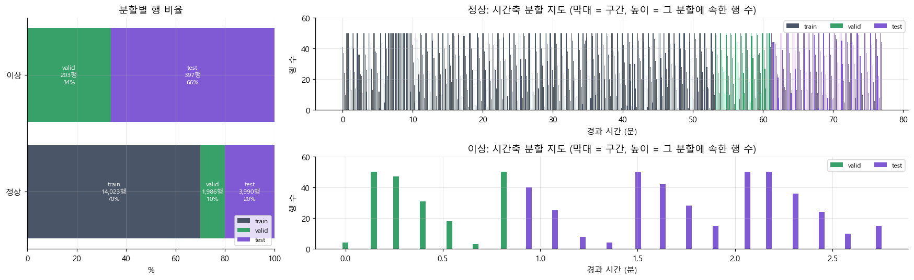

*v4_1 분할: 정상 7:1:2, 이상 0:1:2*

## 3-2. 시간 간격과 끊김 (Train+Valid)

| 데이터 | 행 | 정확히 100 ms 간격 | 끊김 수 | 끊김 길이 최소(초) | 끊김 길이 중앙값(초) | 끊김 길이 최대(초) | 구간 수 | 구간 길이 중앙값(행) | 가장 긴 구간(행) |
|---|---|---|---|---|---|---|---|---|---|
| 정상 | 16,009 | 97.0% | 480 | 1.6 | 4.2 | 16.5 | 481 | 37 | 50 |
| 이상 | 203 | 97.0% | 6 | 2.0 | 5.8 | 8.5 | 7 | 31 | 50 |

정상 Train+Valid는 간격의 97.0%가 정확히 100 ms이고, 끊김 480개(길이 중앙값 4.2초)로 구간 481개(길이 중앙값 37행)로 나뉩니다. 끊김 길이가 100 ms 배수에서 ±5 ms 이내인 비율은 12%, 구간 박자 위치의 표준편차는 28 ms라 샘플 몇 개가 빠진 것이 아니라 **기록이 멈췄다가 새 박자로 다시 시작**된 것으로 보입니다.

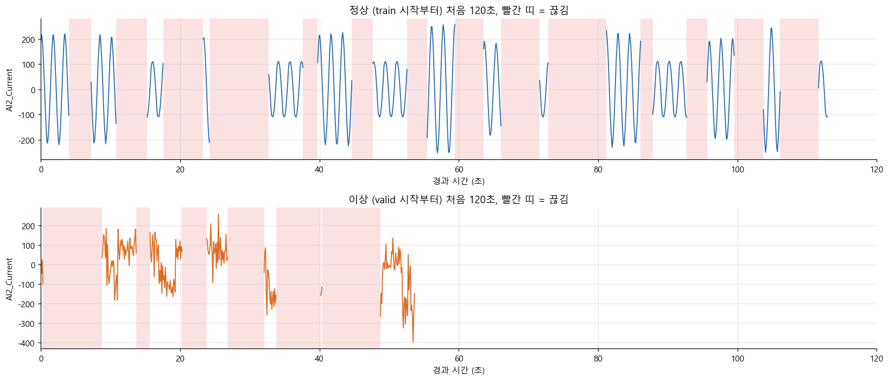

*앞부분 전류 파형과 끊김(빨간 띠)*

*기록 간격 분포: 범위별 개수, 1 ms 히스토그램, 누적 비율 (Train+Valid)*

**끊김 길이** (이상은 Valid 구간 7개 사이의 끊김 6개뿐이라 참고용)

| 끊김 길이 | 정상 | 이상 |
|---|---|---|
| <1초 | 0% | 0% |
| 1–2초 | 20% | 17% |
| 2–5초 | 43% | 17% |
| 5–10초 | 37% | 67% |
| ≥10초 | 0% | 0% |

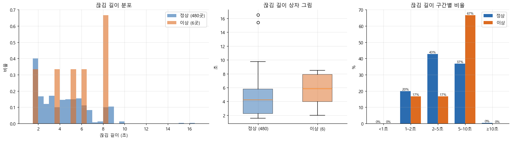

*끊김 길이 (Train+Valid, 괄호 = 끊김 수)*

**재시작 근거와 구간 길이**

| 데이터 | 끊김 수 | 100 ms 배수에서 ±5 ms 이내 비율 | 구간 박자 위치 표준편차(ms) | 구간 안 간격이 정확히 100 ms인 비율 |
|---|---|---|---|---|
| 정상 | 480 | 12% | 27.6 | 100.0% |
| 이상 | 6 | 0% | 30.3 | 100.0% |

샘플 몇 개만 빠진 것이라면 "±5 ms 이내 비율"이 100%에 가깝고 박자 위치 표준편차가 0에 가깝습니다. 무작위로 다시 시작했다면 각각 약 10%, 약 29 ms입니다.

*재시작 근거(위)와 구간 길이(아래), Train+Valid*

## 4. 원 신호: 상관, 고윳값, 시간 구조

| 데이터 | 고윳값 1 | 고윳값 2 | 고윳값 3 | 1번 비중 |
|---|---|---|---|---|
| 정상 | 1.389 | 1.000 | 0.611 | 46% |
| 이상 | 1.440 | 1.007 | 0.553 | 48% |

상관과 고윳값은 구간마다 평균을 빼고 계산했습니다. 고윳값 1번 비중이 크면 세 센서가 한 방향으로 같이 움직인다는 뜻입니다.

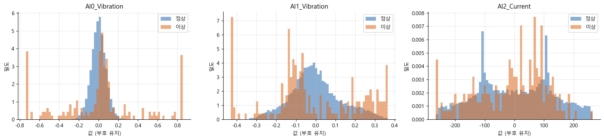

*센서 값 분포 (Train+Valid)*

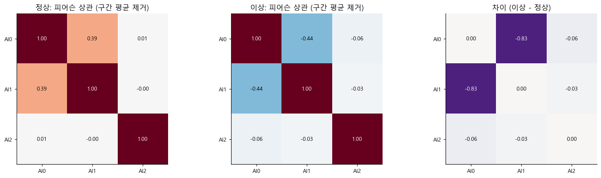

*센서 간 상관 (Train+Valid, 구간마다 평균 제거)*

**자기상관과 시차 상호상관** (구간 안에서 계산)

| 센서 | 데이터 | 0.1초 뒤 자기상관 | 추정 주기(초) | 가장 강한 반복(최대 자기상관) |
|---|---|---|---|---|
| AI0_Vibration | 정상 | 0.031 | 0.600 | 0.553 |
| AI0_Vibration | 이상 | 0.712 | 0.800 | 0.299 |
| AI1_Vibration | 정상 | 0.330 | 0.600 | 0.900 |
| AI1_Vibration | 이상 | 0.581 |  | 0.166 |
| AI2_Current | 정상 | 0.927 | 1.600 | 0.802 |
| AI2_Current | 이상 | 0.516 |  | 0.483 |

| 센서 쌍 | 데이터 | 시차 0 상관 | 가장 강한 시차(초) | 그때 상관 |
|---|---|---|---|---|
| AI0-AI1 | 정상 | 0.389 | 0.200 | -0.503 |
| AI0-AI1 | 이상 | -0.439 | -0.100 | -0.677 |
| AI0-AI2 | 정상 | 0.0068 | 0.100 | 0.00823 |
| AI0-AI2 | 이상 | -0.057 | 0.500 | -0.123 |
| AI1-AI2 | 정상 | -1.96e-05 | -0.200 | 0.00524 |
| AI1-AI2 | 이상 | -0.027 | 0.400 | -0.131 |

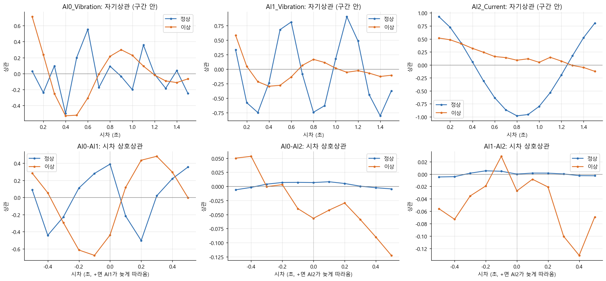

*자기상관(위)과 센서 간 시차 상호상관(아래), 구간 안에서 계산*

**값 분포: 부호 유지와 절댓값** (절댓값을 쓰면 진동의 방향 정보가 사라집니다)

| 센서 | 데이터 | 중앙값(부호 유지) | IQR(부호 유지) | 중앙값(절댓값) | IQR(절댓값) |
|---|---|---|---|---|---|
| AI0_Vibration | 정상 | 0.000413 | 0.095 | 0.048 | 0.062 |
| AI0_Vibration | 이상 | 0.034 | 0.303 | 0.130 | 0.499 |
| AI1_Vibration | 정상 | -0.011 | 0.152 | 0.077 | 0.111 |
| AI1_Vibration | 이상 | -0.071 | 0.332 | 0.156 | 0.190 |
| AI2_Current | 정상 | 1.124 | 210.621 | 105.311 | 91.810 |
| AI2_Current | 이상 | 10.729 | 175.238 | 85.831 | 96.560 |

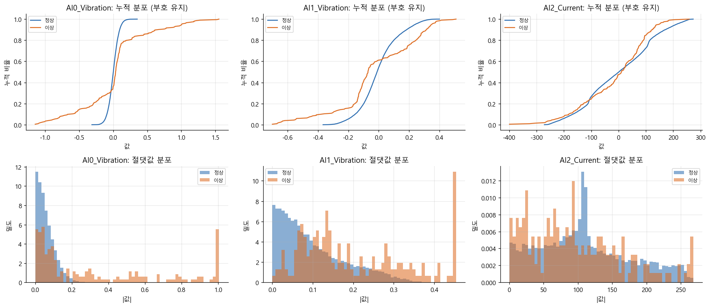

*센서 값의 누적 분포(위)와 절댓값 분포(아래), Train+Valid*

**파형**

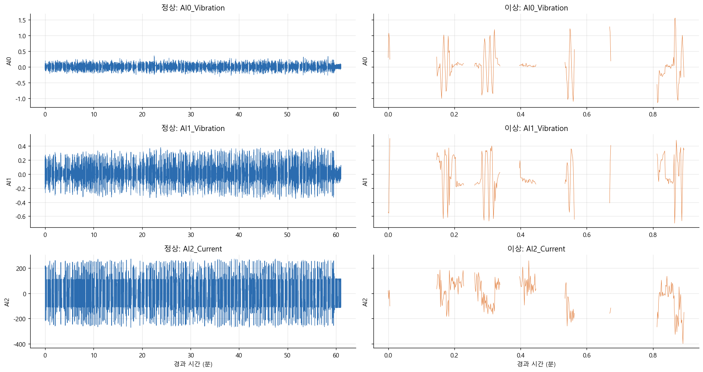

*상태별 전체 파형 (Train+Valid, 끊긴 곳에서 선이 끊김)*

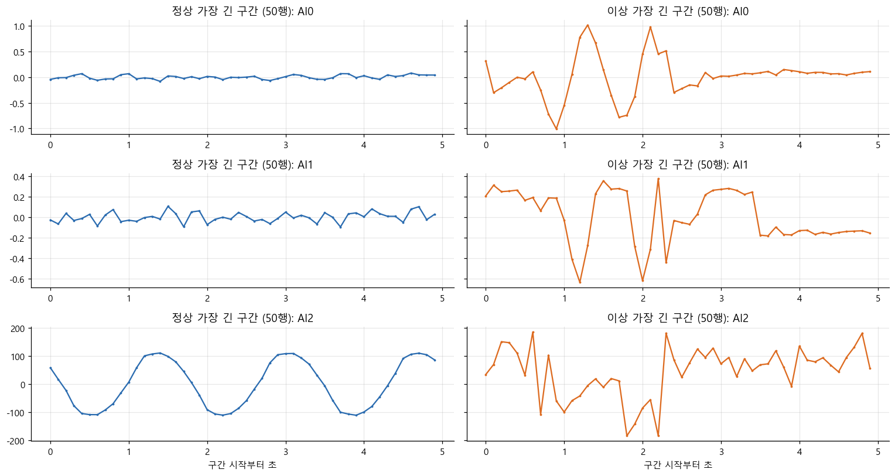

*가장 긴 구간 확대 (같은 세로 눈금)*

**윈도 길이별 윈도 수와 행 활용률** (v4_1 규칙, 분석에는 20행 사용)

| 데이터 | split | 16 | 20 | 30 | 50 |
|---|---|---|---|---|---|
| 이상 | valid | 121 | 102 | 62 | 2 |
| 정상 | train | 8,306 | 7,005 | 4,152 | 148 |
| 정상 | valid | 1,174 | 985 | 573 | 17 |

| 데이터 | split | 16 | 20 | 30 | 50 |
|---|---|---|---|---|---|
| 이상 | valid | 97% | 88% | 88% | 49% |
| 정상 | train | 95% | 93% | 82% | 53% |
| 정상 | valid | 95% | 94% | 81% | 43% |

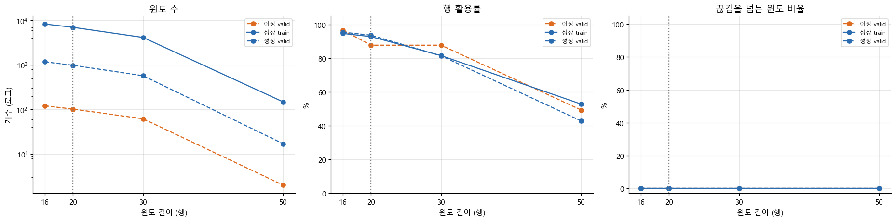

*윈도 길이별 윈도 수, 행 활용률, 끊김을 넘는 비율 (v4_1 규칙, 점선 = 분석에 쓰는 20행)*

**스펙트럼** (가장 센 주파수, Hz)

| 센서 | 이상 | 정상 |
|---|---|---|
| AI0_Vibration | 1.000 | 3.500 |
| AI1_Vibration | 0.500 | 2.000 |
| AI2_Current | 1.000 | 0.500 |

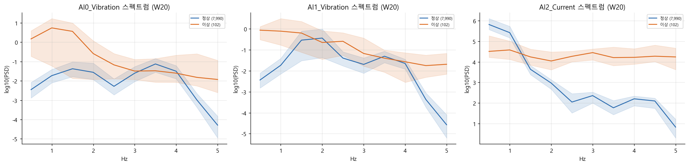

*센서별 스펙트럼: 윈도별 중앙값과 25~75% 범위 (Train+Valid, W20)*

## 5. 파생변수 구분력 (Valid)

AUC 0.5는 못 가름, 1은 완벽입니다. 95% 구간은 판정 단위 구간을 다시 뽑아 계산했습니다 (참고용 (이상 구간 4개)).

| 변수 | 분류 | AUC | 95% 구간 | 방향 | KS | 라벨 상관 |
|---|---|---|---|---|---|---|
| AI2_band_high | 주파수 | 1.000 | 1.00 ~ 1.00 | 이상에서 큼 | 1.000 | 0.885 |
| AI2_band_low | 주파수 | 1.000 | 1.00 ~ 1.00 | 이상에서 작음 | 1.000 | -0.935 |
| AI2_acf1 | 시간 변화 | 1.000 | 1.00 ~ 1.00 | 이상에서 작음 | 1.000 | -0.900 |
| AI2_band_mid | 주파수 | 1.000 | 1.00 ~ 1.00 | 이상에서 큼 | 1.000 | 0.847 |
| AI2_centroid | 주파수 | 1.000 | 1.00 ~ 1.00 | 이상에서 큼 | 1.000 | 0.923 |
| AI2_entropy | 주파수 | 1.000 | 1.00 ~ 1.00 | 이상에서 큼 | 1.000 | 0.987 |
| AI2_p2p_std | 모양 | 0.982 | 0.96 ~ 1.00 | 이상에서 큼 | 0.889 | 0.782 |
| AI2_crest | 모양 | 0.970 | 0.92 ~ 1.00 | 이상에서 큼 | 0.794 | 0.728 |
| ratio_AI1_AI2 | 센서 간 관계 | 0.959 | 0.80 ~ 1.00 | 이상에서 큼 | 0.882 | 0.815 |
| AI2_kurt | 모양 | 0.958 | 0.92 ~ 1.00 | 이상에서 큼 | 0.854 | 0.728 |
| AI2_diff_rms | 시간 변화 | 0.953 |  | 이상에서 큼 | 0.792 | 0.707 |
| AI0_peak_hz | 주파수 | 0.947 |  | 이상에서 작음 | 0.866 | -0.474 |
| AI0_acf1 | 시간 변화 | 0.933 |  | 이상에서 큼 | 0.785 | 0.554 |
| AI0_band_low | 주파수 | 0.931 |  | 이상에서 큼 | 0.777 | 0.599 |
| AI0_centroid | 주파수 | 0.929 |  | 이상에서 작음 | 0.764 | -0.540 |

**분류별 구분력**

| 분류 | 최고 AUC | 중앙 AUC | 변수 수 |
|---|---|---|---|
| 주파수 | 1.000 | 0.912 | 18 |
| 시간 변화 | 1.000 | 0.864 | 12 |
| 모양 | 0.982 | 0.598 | 12 |
| 센서 간 관계 | 0.959 | 0.854 | 6 |
| 크기 | 0.909 | 0.838 | 15 |

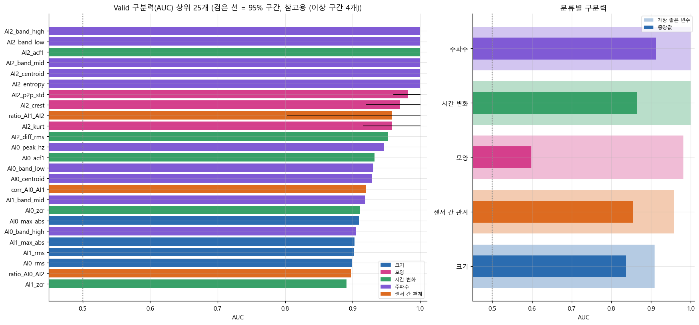

*파생변수 구분력(AUC) 순위와 분류별 비교*

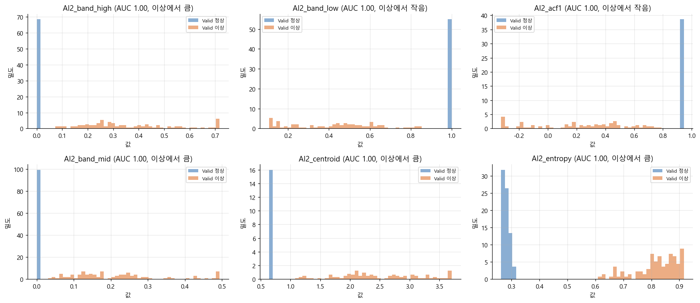

*구분력 상위 6개 변수의 분포 (Valid)*

**선택 낙관도 (변수 기준)**

| 방식 | 고른 쪽 상위 10개 평균 AUC | 다른 쪽 평균 AUC | 차이 |
|---|---|---|---|
| 앞 절반에서 고르고 뒤 절반에서 확인 | 0.998 | 0.929 | -0.069 |
| 뒤 절반에서 고르고 앞 절반에서 확인 | 0.991 | 0.981 | -0.010 |

**RMS–P2P 관계** (참고 분석. 구분력 순위와 후보에는 넣지 않음)

| 센서 | RMS만 | P2P만 | 띠에서 벗어난 정도 |
|---|---|---|---|
| AI0_Vibration | 0.899 | 0.855 | 0.919 |
| AI1_Vibration | 0.902 | 0.838 | 0.921 |
| AI2_Current | 0.511 | 0.515 | 0.917 |

전류는 RMS만으로 AUC 0.51, P2P만으로 0.51이지만, RMS–P2P 정상 띠에서 벗어난 정도로는 0.92입니다. 이상은 세기보다 파형 모양이 바뀐 것입니다.

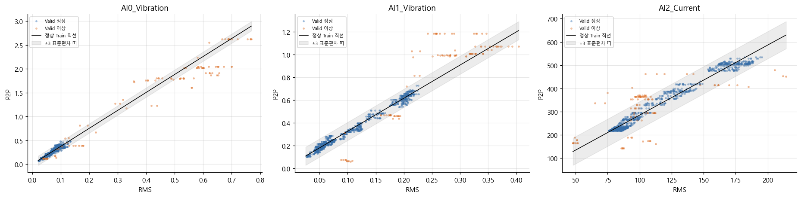

*RMS–P2P 정상 띠와 Valid 점 (띠에서 벗어나면 파형 모양이 바뀐 것)*

## 6. 파생변수 간 상관과 중복

62개 변수를 상관 0.9 이상끼리 묶으면 42개 묶음입니다. 정상 Train에서 값이 하나뿐인 `AI2_peak_hz`는 상관과 PCA에서 뺐습니다. 아래는 구분력이 높은 묶음 15개입니다.

| 개수 | 묶인_변수 | 대표 변수 | 대표 AUC |
|---|---|---|---|
| 2 | AI2_band_mid, AI2_band_low | AI2_band_low | 1.000 |
| 1 | AI2_acf1 | AI2_acf1 | 1.000 |
| 2 | AI2_centroid, AI2_entropy | AI2_centroid | 1.000 |
| 1 | AI2_band_high | AI2_band_high | 1.000 |
| 3 | AI2_p2p_std, AI2_crest, AI2_kurt | AI2_p2p_std | 0.982 |
| 1 | ratio_AI1_AI2 | ratio_AI1_AI2 | 0.959 |
| 10 | AI2_diff_rms, AI1_max_abs, AI1_rms, AI1_std, AI1_p2p, AI1_diff_rms, AI2_max_abs, AI2_std, AI2_p2p, AI2_rms | AI2_diff_rms | 0.953 |
| 1 | AI0_peak_hz | AI0_peak_hz | 0.947 |
| 1 | AI0_acf1 | AI0_acf1 | 0.933 |
| 1 | AI0_band_low | AI0_band_low | 0.931 |
| 2 | AI0_centroid, AI0_band_high | AI0_centroid | 0.929 |
| 1 | corr_AI0_AI1 | corr_AI0_AI1 | 0.920 |
| 1 | AI1_band_mid | AI1_band_mid | 0.919 |
| 1 | AI0_zcr | AI0_zcr | 0.911 |
| 2 | AI0_max_abs, AI0_p2p | AI0_max_abs | 0.909 |

**상관계수 방법**: 상관계수는 피어슨 하나로 통일했습니다. 스피어만과 비교한 결과는 아래와 같습니다. 두 방법이 거의 같아 피어슨만 봐도 됩니다.

| 항목 | 값 |
|---|---|
| 많이 치우친 변수 (왜도 절댓값 > 1) | 11개 / 62개 |
| 피어슨과 스피어만 차이의 중앙값 | 0.016 |
| 차이가 0.2 이상인 변수 쌍 | 4쌍 / 1,891쌍 |
| 가장 큰 차이 | 0.37 |
| 묶음 수 (피어슨 / 스피어만) | 42개 / 43개 |
| 묶음 결과 일치도 (ARI, 1 = 같음) | 0.65 |

**다중공선성(VIF)**: 정상 Train으로 계산했습니다. 대표 변수 전체에서 시작해, VIF가 5를 넘는 변수 중 구분력이 가장 낮은 것을 하나씩 뺐고, 남은 변수 중 구분력 상위 10개를 골랐습니다.

| 항목 | 값 |
|---|---|
| 전체 변수 수 | 62 |
| VIF > 5 | 45 |
| VIF > 10 | 40 |
| VIF 무한대 (다른 변수로 정확히 계산됨) | 9 |
| 최종 대표 변수 수 | 10 |
| 최종 대표 변수의 최대 VIF | 3.66 |
| VIF 때문에 뺀 대표 변수 | 15 |

| 변수 | AUC | VIF | 분류 |
|---|---|---|---|
| AI2_band_low | 1.000 | 3.657 | 주파수 |
| AI2_acf1 | 1.000 | 1.308 | 시간 변화 |
| AI2_centroid | 1.000 | 1.237 | 주파수 |
| ratio_AI1_AI2 | 0.959 | 3.227 | 센서 간 관계 |
| AI0_peak_hz | 0.947 | 3.050 | 주파수 |
| AI0_band_low | 0.931 | 3.339 | 주파수 |
| corr_AI0_AI1 | 0.920 | 1.705 | 센서 간 관계 |
| AI1_band_mid | 0.919 | 1.229 | 주파수 |
| AI0_zcr | 0.911 | 2.554 | 시간 변화 |
| AI0_max_abs | 0.909 | 1.973 | 크기 |

**VIF 때문에 뺀 대표 변수** (뺀 순서)

| 뺀 변수 | 그때 VIF | AUC | 가장 많이 겹친 변수 | 상관 절댓값 |
|---|---|---|---|---|
| AI0_crest | 17.085 | 0.522 | AI0_kurt | 0.803 |
| AI1_kurt | 8.300 | 0.547 | AI1_p2p_std | 0.889 |
| AI1_p2p_std | 5.465 | 0.550 | AI1_crest | 0.830 |
| AI1_entropy | 5.001 | 0.658 | AI2_diff_rms | 0.808 |
| AI0_diff_rms | 25.785 | 0.781 | AI0_rms | 0.841 |
| ratio_AI0_AI1 | 23.877 | 0.811 | ratio_AI1_AI2 | 0.764 |
| AI0_band_mid | 15.025 | 0.814 | AI2_diff_rms | 0.679 |
| AI1_acf1 | 11.570 | 0.846 | AI1_zcr | 0.868 |
| ratio_AI0_AI2 | 22.942 | 0.897 | AI2_diff_rms | 0.445 |
| AI0_rms | 12.015 | 0.899 | AI0_max_abs | 0.885 |
| AI0_centroid | 23.214 | 0.929 | AI0_band_low | 0.924 |
| AI0_acf1 | 7.283 | 0.933 | AI0_zcr | 0.864 |
| AI2_diff_rms | 10.729 | 0.953 | AI2_band_low | 0.871 |
| AI2_p2p_std | 6.850 | 0.982 | ratio_AI1_AI2 | 0.640 |
| AI2_band_high | 5.860 | 1.000 | AI2_band_low | 0.816 |

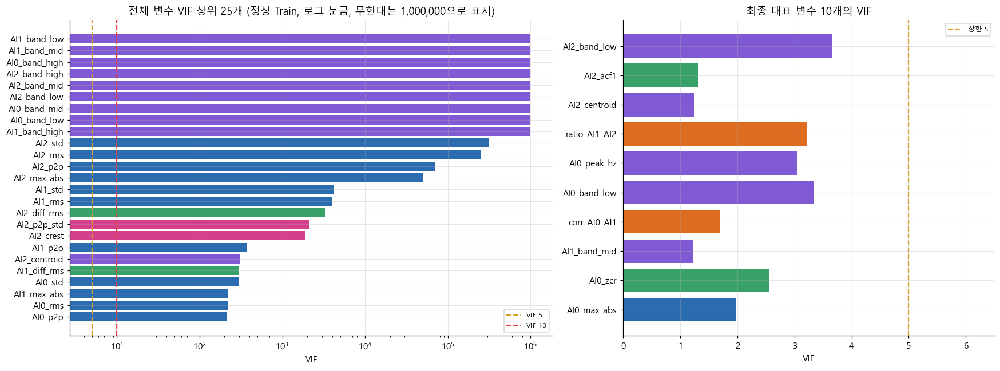

*VIF: 전체 변수의 겹침(왼쪽)과 최종 대표 변수(오른쪽)*

**이상에서 가장 크게 바뀌는 관계**

| 변수 1 | 변수 2 | 정상 상관 | 이상 상관 | 차이 |
|---|---|---|---|---|
| ratio_AI1_AI2 | AI2_diff_rms | 0.893 | -0.433 | -1.326 |
| ratio_AI1_AI2 | corr_AI0_AI1 | 0.730 | -0.501 | -1.231 |
| AI2_band_low | corr_AI0_AI1 | 0.723 | -0.469 | -1.192 |
| AI2_band_high | corr_AI0_AI1 | -0.418 | 0.686 | 1.104 |
| AI2_p2p_std | ratio_AI1_AI2 | 0.678 | -0.408 | -1.086 |
| AI2_band_low | AI2_p2p_std | 0.418 | -0.633 | -1.051 |
| AI0_acf1 | corr_AI0_AI1 | 0.270 | -0.684 | -0.954 |
| AI0_peak_hz | corr_AI0_AI1 | -0.329 | 0.624 | 0.953 |

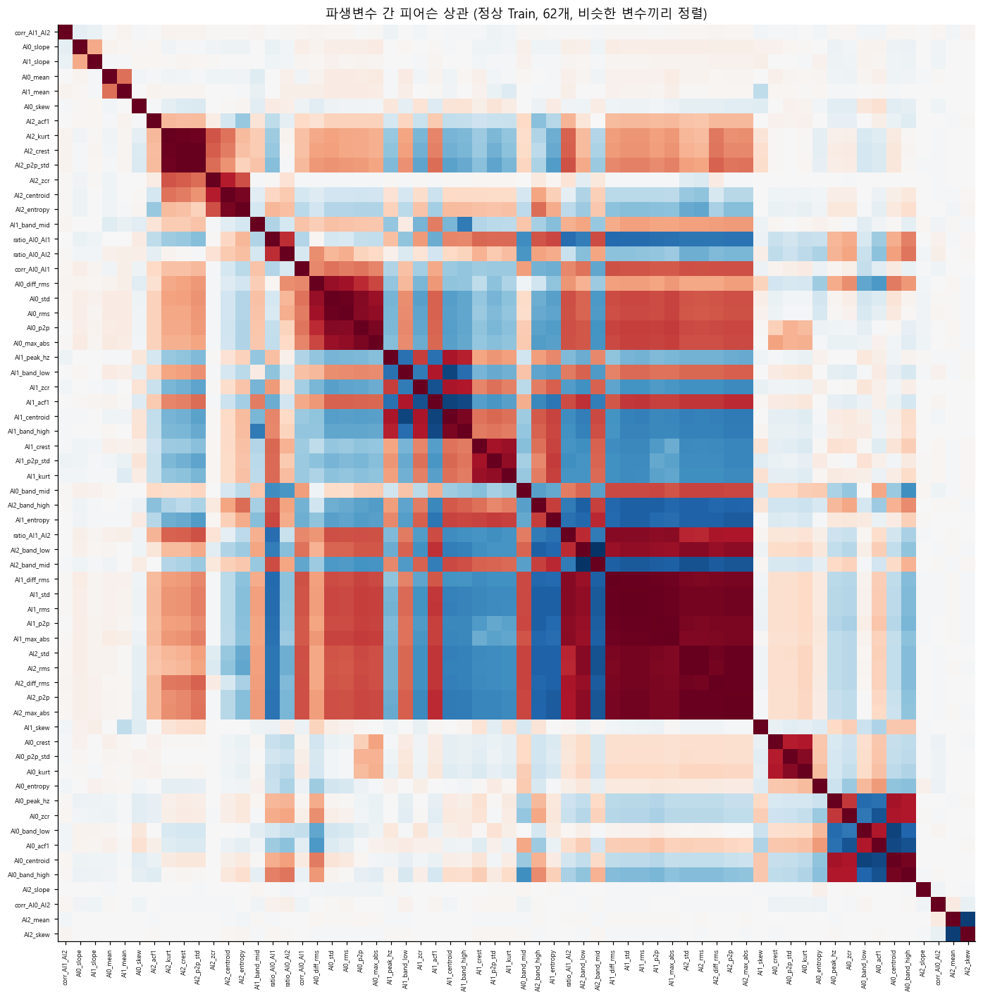

*파생변수 간 상관 히트맵 (정상 Train)*

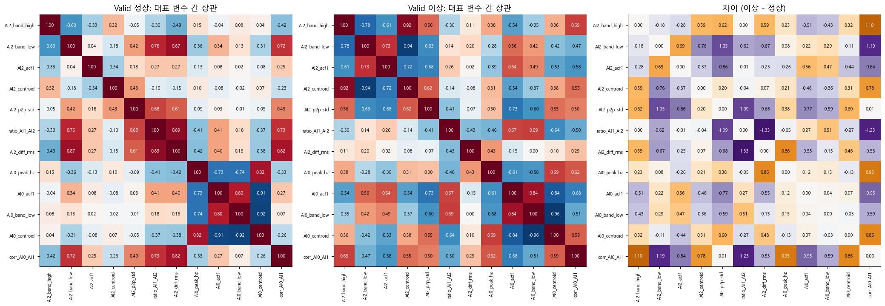

*대표 변수 간 관계가 이상에서 어떻게 바뀌는지*

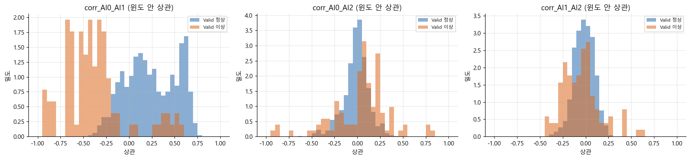

*윈도 안 센서 간 상관의 분포 (Valid)*

## 7. 고윳값(PCA)

| 항목 | 값 |
|---|---|
| 사용한 변수 수 | 62 |
| 고윳값 > 1인 주성분 수 | 14 |
| 90% 설명에 필요한 주성분 수 | 17 |
| 95% 설명에 필요한 주성분 수 | 23 |
| 주성분 1의 설명 비율 | 37% |
| 주성분 1+2의 설명 비율 | 49% |

| 점수 | Valid AUC |
|---|---|
| Hotelling T² | 1.000 |
| SPE (Q) | 1.000 |
| 마할라노비스 거리² | 1.000 |
| (비교) 가장 좋은 단일 변수 AI2_band_high | 1.000 |

| 순위 | PC1 | PC2 | PC3 | PC4 | PC5 |
|---|---|---|---|---|---|
| 1위 | AI2_max_abs (+0.20) | AI0_centroid (+0.32) | AI2_centroid (+0.44) | AI0_max_abs (+0.36) | AI0_kurt (+0.43) |
| 2위 | AI2_p2p (+0.20) | AI0_acf1 (-0.32) | AI2_zcr (+0.42) | AI0_p2p (+0.34) | AI0_p2p_std (+0.42) |
| 3위 | AI1_rms (+0.20) | AI0_band_high (+0.31) | AI2_entropy (+0.38) | AI0_p2p_std (+0.32) | AI0_crest (+0.42) |
| 4위 | AI1_std (+0.20) | AI0_zcr (+0.29) | AI2_kurt (+0.36) | ratio_AI0_AI2 (+0.31) | ratio_AI0_AI2 (-0.21) |

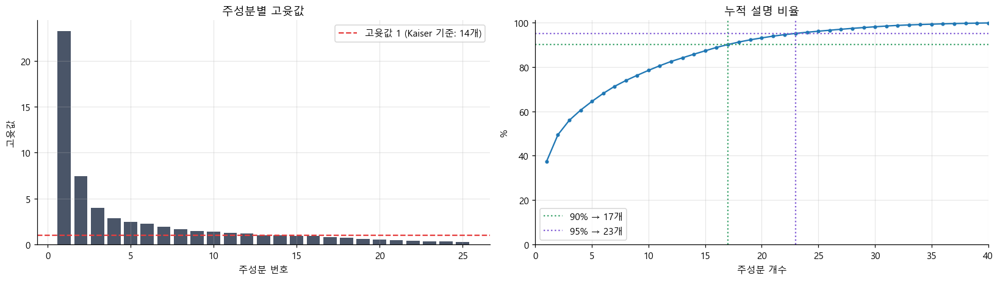

*정상 Train 파생변수의 고윳값과 누적 설명 비율*

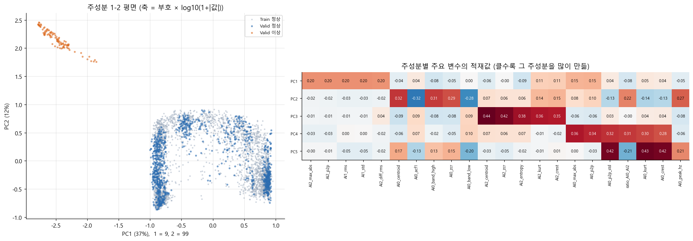

*주성분 평면의 정상·이상과 주성분 적재값*

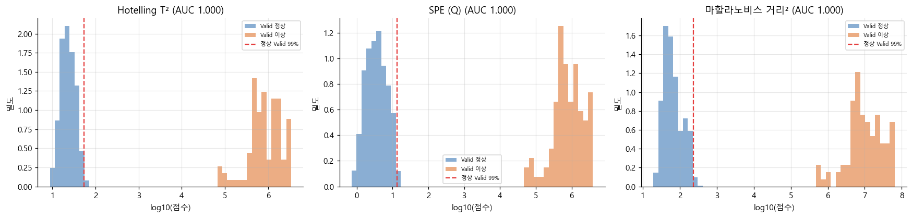

*고윳값 기반 이상 점수 분포 (주성분 23개 사용)*

## 8. 시간에 따른 변화와 공백 관련 점검 (정상)

| 변수 | KS | Train 중앙값 | Valid 중앙값 | 구분력 AUC |
|---|---|---|---|---|
| AI0_max_abs | 0.219 | 0.150 | 0.128 | 0.909 |
| AI0_p2p | 0.218 | 0.269 | 0.233 | 0.855 |
| AI2_band_high | 0.203 | 0.00055 | 0.000276 | 1.000 |
| AI0_rms | 0.195 | 0.073 | 0.065 | 0.899 |
| AI1_max_abs | 0.192 | 0.201 | 0.141 | 0.903 |
| AI0_std | 0.182 | 0.071 | 0.064 | 0.851 |
| AI2_band_mid | 0.179 | 0.00147 | 0.00208 | 1.000 |
| AI2_max_abs | 0.175 | 173.581 | 135.879 | 0.705 |
| AI2_p2p | 0.172 | 343.465 | 266.217 | 0.515 |
| AI1_p2p | 0.170 | 0.349 | 0.254 | 0.838 |

**재시작 직후 효과** (변수 전체 중 차이가 큰 10개, IQR 단위. 0.5를 넘으면 효과 있음)

| 변수 | 구간 첫 윈도 중앙값 | 1초 이후 중앙값 | 차이 ÷ IQR |
|---|---|---|---|
| AI0_peak_hz | 3.500 | 3.000 | 0.250 |
| AI0_zcr | 0.526 | 0.474 | 0.200 |
| AI2_skew | 0.059 | -0.00287 | 0.111 |
| AI0_entropy | 0.731 | 0.720 | 0.105 |
| AI0_slope | 0.00229 | -0.000344 | 0.100 |
| AI0_crest | 2.116 | 2.077 | 0.095 |
| AI0_band_high | 0.395 | 0.355 | 0.093 |
| AI2_mean | -2.028 | 0.804 | -0.085 |
| AI1_crest | 1.832 | 1.805 | 0.083 |
| ratio_AI0_AI2 | 0.00058 | 0.000563 | 0.075 |

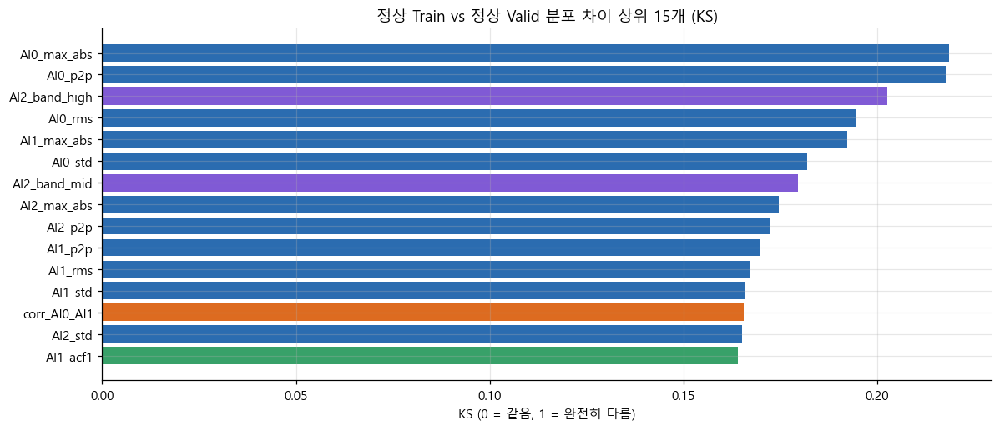

*정상 상태의 시간에 따른 변화(드리프트)*

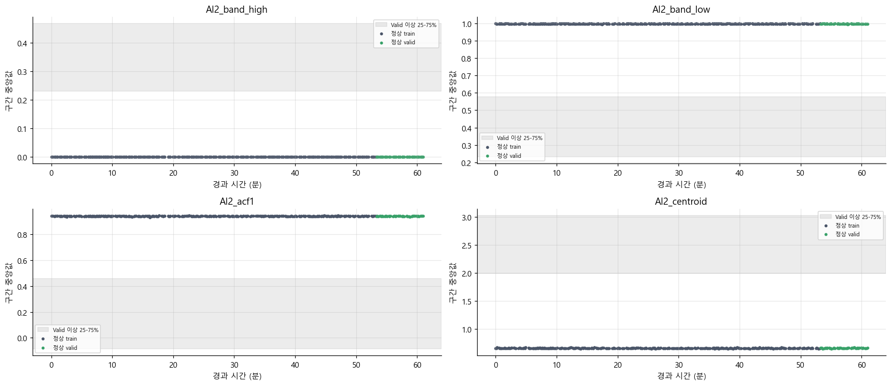

*대표 변수의 시간 추세 (정상, 판정 단위 구간별 중앙값)*

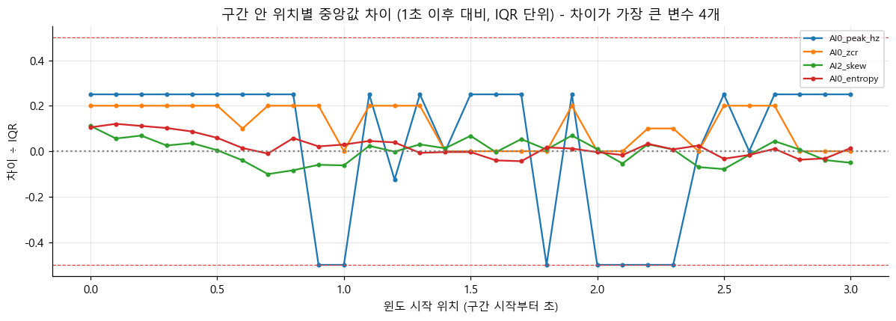

*재시작 직후 효과 (정상 Train, 전체 변수 중 차이가 큰 4개)*

## 9. 후보 네 가지의 Valid 성능

임계값은 정상 Valid 상위 1% 지점입니다. 계산 방식과 임계값은 `frozen_pipeline.json`에 남겼습니다.

- 단일 변수: `AI2_band_high`
- 대표 변수 10개: `AI2_band_low`, `AI2_acf1`, `AI2_centroid`, `ratio_AI1_AI2`, `AI0_peak_hz`, `AI0_band_low`, `corr_AI0_AI1`, `AI1_band_mid`, `AI0_zcr`, `AI0_max_abs`

| 후보 | 임계값 | 정밀도 | 재현율 | F1 | 정상 오탐률 | AP | AUC | TP | FP | FN | 분리 여유 | 이상 구간 경보 | 정상 구간 오경보 | 정상 구간 오경보율 |
|---|---|---|---|---|---|---|---|---|---|---|---|---|---|---|
| 단일 변수 | 0.00115 | 0.911 | 1.000 | 0.953 | 0.010 | 1.000 | 1.000 | 102 | 10 | 0 | 95.127 | 4 / 4 | 4 / 46 | 0.087 |
| 대표 변수 마할라노비스 거리² | 29.450 | 0.911 | 1.000 | 0.953 | 0.010 | 1.000 | 1.000 | 102 | 10 | 0 | 4,712 | 4 / 4 | 5 / 46 | 0.109 |
| PCA Hotelling T² | 54.625 | 0.911 | 1.000 | 0.953 | 0.010 | 1.000 | 1.000 | 102 | 10 | 0 | 2,277 | 4 / 4 | 6 / 46 | 0.130 |
| PCA SPE (Q) | 13.445 | 0.911 | 1.000 | 0.953 | 0.010 | 1.000 | 1.000 | 102 | 10 | 0 | 8,424 | 4 / 4 | 5 / 46 | 0.109 |

Valid 정상 오탐률이 약 1%인 것은 임계값을 그렇게 정했기 때문이고, Valid F1도 이 설정이 만드는 숫자라 성능 근거가 아닙니다. 폴더끼리는 분리 여유와 정상 구간 오경보로 비교하세요.

**이상 Valid 판정 단위 구간**

| 이상 Valid 구간 | 판정 단위 구간 | 판정 불가 구간 | 입력에 안 쓰인 이상 행 비율 |
|---|---|---|---|
| 7 | 4 | 3 | 12.3% |

**선택 낙관도 (최종 후보 기준)**

| 후보 | 고른 쪽 AUC | 다른 쪽 AUC | 차이 |
|---|---|---|---|
| 단일 변수 | 1.000 | 1.000 | 0.000 |
| 대표 변수 마할라노비스 거리² | 1.000 | 1.000 | 0.000 |
| PCA Hotelling T² | 1.000 | 1.000 | 0.000 |
| PCA SPE (Q) | 1.000 | 1.000 | 0.000 |

## 10. 시계열 이상탐지에서 자주 쓰는 파생변수와 방법

| 분류 | 파생변수·방법 | 무엇을 보나 | 이번 분석 |
|---|---|---|---|
| 크기 | RMS, 표준편차, P2P, 최대 절댓값 | 신호 세기 | 04-05 |
| 모양 | 첨도, 왜도, 크레스트 팩터, P2P/표준편차 | 순간 충격, 튀는 값 | 04-05 |
| 시간 변화 | 1차 차분 RMS, 기울기, lag-1 자기상관, 평균선 교차율 | 변화 속도, 거칠기, 추세 | 04-05 |
| 주파수 | 대역 에너지 비율, 스펙트럼 중심, 스펙트럼 엔트로피, 최대 주파수 | 진동 성분 분포 (0-5 Hz) | 04-05 |
| 센서 간 관계 | 윈도 안 상관, RMS 비율, 시차 상호상관 | 센서가 함께 움직이는 방식 | 03, 06 |
| 고윳값 기반 | PCA Hotelling T², SPE(Q) | 정상 공간 안팎의 이탈 | 07 |
| 다변량 거리 | 마할라노비스 거리(²) | 정상 중심에서 먼 정도 | 07, 09 |
| 관계 이탈 | RMS-P2P 회귀 잔차 | 정상 관계에서 벗어남 | 종합분석 08-4 |
| 거리·밀도 | Isolation Forest, LOF, kNN 거리 | 드문 패턴 | 종합분석 E1-E3 |
| 예측·복원 오차 | AR 예측 오차, 오토인코더 복원 오차 | 다음 값이나 모양을 맞히지 못하는 정도 | 이 노트북에서는 미실시 |
| 변화점·관리도 | CUSUM, EWMA | 평균·분산이 바뀌는 시점 | 미실시. 정상에서 이상으로 바뀌는 순간이 데이터에 없음 |
| 웨이블릿·포락선 | 웨이블릿 에너지, 힐버트 포락선 | 짧은 충격, 변조 | 미실시. 10 Hz라 효과 제한 |
| 행렬 프로파일 | 가장 비슷한 과거 구간과의 거리 | 처음 보는 모양 | 미실시 |

## 11. 주의할 점

- **날짜 차이**: 정상과 이상의 측정 날짜가 달라서, 구분력이 높은 변수가 고장이 아니라 날짜나 운전 조건 차이를 잡았을 수 있습니다.
- **너무 완벽한 분리**: Valid AUC가 0.99 이상인 변수가 6개입니다. 측정 설정이나 운전 조건이 통째로 달라서 생긴 차이일 수도 있으니, 두 데이터의 측정 조건이 같은지 확인하는 것이 좋습니다.
- **적은 이상 사례**: 이상 Valid 판정 단위 구간은 4개입니다. 겹치는 윈도는 독립 사례가 아니므로 AUC 순위를 확정된 결론으로 보면 안 됩니다.
- **폴더 비교**: v4_1과 v4_2는 분할 경계, 윈도, Valid 데이터가 함께 다릅니다. 두 결과의 차이는 처리 방식 전체의 차이입니다. v4_2와 v4_3은 라벨 위치 하나만 다릅니다.
- **변수 값**: 세 폴더 모두 부호를 유지한 원래 값으로 변수를 계산합니다.
- **주파수 한계**: 10 Hz 샘플링이라 0-5 Hz만 볼 수 있습니다. 부품 고장 주파수 진단이 아닙니다.

## 12. 다음 단계 제안

1. **세 폴더 비교**: `v4_비교.md`에서 처리 방식에 따른 차이를 보고 공식 분할을 정합니다.
2. **설정 민감도**: `WINDOW`(16, 20, 30), `VIF_MAX`(5, 10)를 바꿔 Train과 Valid 결과가 유지되는지 봅니다.
3. **오탐 위치 분석**: Valid 오탐이 언제, 구간의 어디서 생기는지 봅니다 (평가표 3번).
4. **경보 규칙**: 연속 k개 윈도가 임계값을 넘을 때만 경보를 울리면 오경보와 탐지 지연이 어떻게 바뀌는지 봅니다 (평가표 4번).
5. **이상 확률 변환**: 점수를 정상 대비 백분위나 보정된 확률로 바꿉니다 (평가표 2번).
6. **AI 모델**: 공식 분할의 `split_manifest.csv`를 읽어 같은 분할로 학습하고, 모든 모델이 완성된 뒤 함께 평가합니다.
