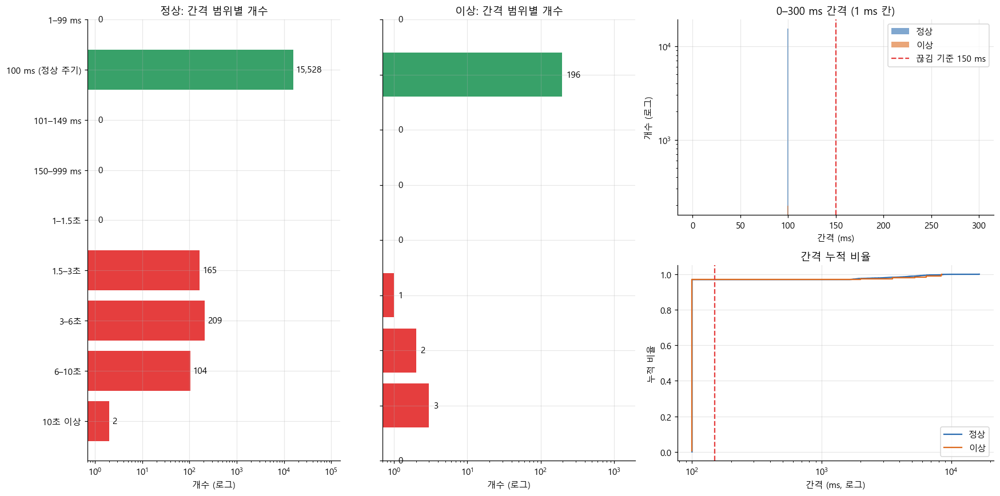
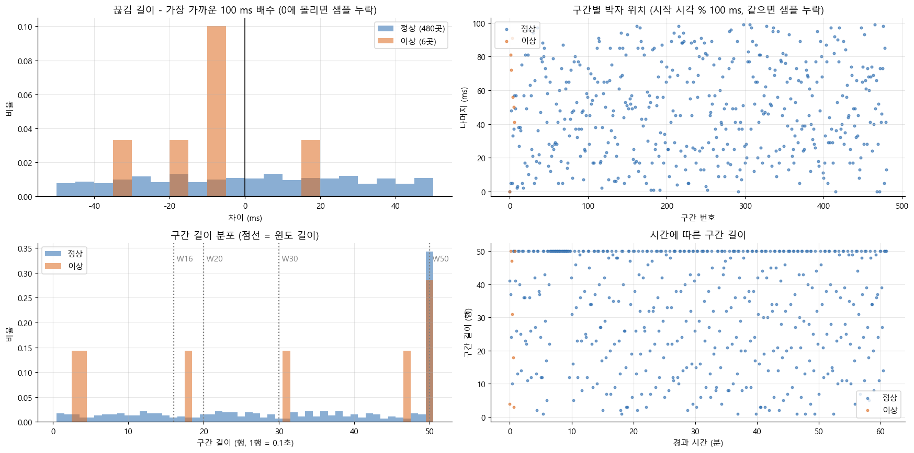
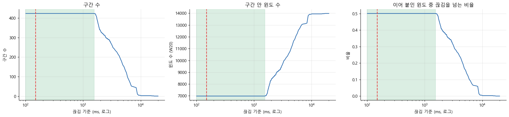
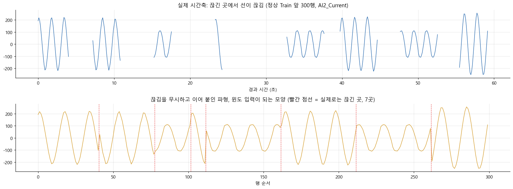
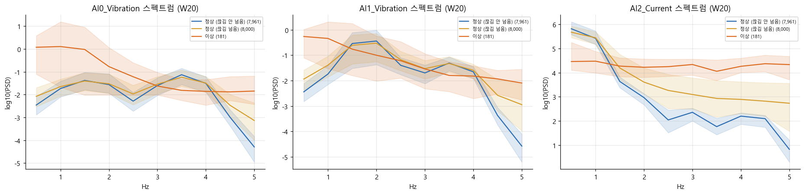

# 데이터 처리 판단 근거: 공백, 분할, 윈도

프레스 유압펌프 진동·전류 데이터(정상 `press_data_normal.csv`, 이상 `outlier_data.csv`)를 모델에 넣기 전에 정한 처리 규칙과, 각 규칙을 정한 기준과 근거를 정리했습니다. 숫자는 `TrainValid분석_v4_1`, `_v4_2`, `_v4_3` 세 분석 폴더의 실행 결과에서 가져왔습니다. 세 폴더 모두 Train과 Valid만 분석에 썼고, Test는 분할 직후 따로 떼어 두었습니다.

| 폴더 | 분할 | 윈도 | 라벨 |
|---|---|---|---|
| v4_1 | 끊김으로 나눈 구간 단위 | 구간 안에서만 | 윈도 마지막 행 |
| v4_2 | 시간순 행 위치에서 자름 (정상 70%·80% 지점, 이상 앞 200행 / 뒤 400행) | 끊김을 넘어 이어 붙임 | 윈도 마지막 행 |
| v4_3 | v4_2와 같음 | v4_2와 같음 | 윈도 시작에서 120행 뒤 행 |

v4_2와 v4_3은 KAMP 가이드북의 처리 방식(행 번호로 분할, 이어 붙인 윈도, 먼 뒤 행의 라벨)을 분석으로 재현한 비교용입니다.

## 0. 결정 요약

| # | 결정 | 기준 | 핵심 근거 |
|---|---|---|---|
| 1 | 기록 사이 공백은 **샘플 누락이 아니라 기록 재시작**으로 본다 | 끊김 길이가 100 ms 배수에 맞는지, 구간마다 박자 위치가 같은지 | ±5 ms 이내 12% (무작위 재시작이면 약 10%), 박자 위치 표준편차 28 ms (무작위면 약 29 ms) |
| 2 | **0.15초보다 긴 간격**을 끊김으로 본다 | 정상 간격(0.1초)과 가장 짧은 끊김(1.55초) 사이, 결과가 기준에 둔감할 것 | 100~1,553 ms 어디로 바꿔도 정상 Train 기간 구간 수 423개로 같음 |
| 3 | 공백을 **보간하지 않는다** | 공백 길이 대비 신호 주기 | 끊김 1.5~16.5초, 신호 한 주기 0.6~1.6초. 보간하면 없는 파형 여러 주기를 지어냄 |
| 4 | 윈도(20행)는 **구간 안에서만** 만든다 | 이어 붙인 윈도가 정상인데도 이상처럼 보이는지 | 이어 붙이면 정상 Train 윈도 50%가 끊김을 넘고, 정상 Valid 오탐이 **전부** 그런 윈도에서 나옴 (2.00% 대 0.00%) |
| 5 | Train/Valid/Test는 **구간 경계에서** 나눈다 | 경계 앞뒤에 같은 연속 기록이 들어가는지 | v4_1의 경계 3곳 모두 실제 끊김(1.8~2.8초) 위. 행 위치로 자르면 연속 기록 한가운데를 자름 |
| 6 | 라벨은 **윈도 마지막 행**으로 한다 (120행 뒤 라벨을 쓰지 않음) | 라벨 의미, 입력에 쓰이는 데이터 양 | 라벨이 파일 단위라 120행 뒤도 같은 값. 이상 Valid 행 50.5%가 입력에서 빠지고 판정 구간이 2개로 줆 |
| 7 | 비율은 **정상 7:1:2, 이상 0:1:2** | 정상만으로 학습하는 이상탐지, Valid에서 임계값 결정 | 이상은 학습에 쓰지 않음. Valid로 변수·후보·임계값을 고르고 Test는 마지막 평가용으로 보관 |
| 8 | 분할 결과를 **`split_manifest.csv`로 고정**한다 | 모든 모델이 같은 행으로 학습·평가되는지 | 원본 행 번호마다 train/valid/test를 기록. 모델끼리 F1을 공정하게 비교할 수 있음 |

**공식 분할은 v4_1**로 정했습니다. v4_2와 v4_3은 "공백을 무시하고 행 단위로 나누면 결과가 어떻게 달라지는가"를 보여 주는 참고 분석입니다.

## 1. 데이터 구조 진단

**기본 정보와 품질**

| 항목 | 정상 | 이상 |
|---|---|---|
| 행 수 | 20,000 (정확히 같은 중복 1행 제거 후 19,999) | 600 |
| 기록 기간 | 2022-07-12 00:00 ~ 01:16 | 2022-07-17 10:51 ~ 10:53 |
| 센서 | AI0_Vibration(상부 진동), AI1_Vibration(하부 진동), AI2_Current(전류) | 같음 |
| 결측·무한대 칸 | 0 | 0 |
| 시간 해석 실패, 시간 역순 | 0, 0 | 0, 0 |
| 라벨 이상 (파일과 다른 Equipment_state) | 0 | 0 |
| 끊김으로 나뉜 구간 | 599개 | 21개 |
| 가장 긴 구간 | 50행 (5초) | 50행 (5초) |

행 단위 결측은 없습니다. 하지만 **시간 단위 결측**, 즉 기록이 멈췄다가 다시 시작한 자리가 많습니다. 가이드북의 품질 검사(결측, 중복, 수집 날짜)는 이 부분을 보지 않습니다. 가이드북 27쪽의 이상 데이터 첫 5행에도 10:51:08.143 다음이 10:51:16.724로, 8.5초가 비어 있습니다.

**시간 간격** (Train+Valid 기준)

| 데이터 | 정확히 100 ms 간격 | 끊김 수 | 끊김 길이 (최소 / 중앙값 / 최대) | 구간 수 | 구간 길이 중앙값 |
|---|---|---|---|---|---|
| 정상 | 97.0% | 480 | 1.6 / 4.2 / 16.5초 | 481 | 37행 |
| 이상 | 97.0% | 6 | 2.0 / 5.8 / 8.5초 | 7 | 31행 |

간격은 정확히 100 ms이거나 1.5초 이상이거나 둘 중 하나이고, 그 사이 값은 없습니다. 이상은 끊김이 6개뿐이라 끊김 길이 분포는 참고용입니다.



## 2. 판단 1: 공백은 기록 재시작이다

**기준.** 샘플 몇 개만 빠졌다면 끊김 길이는 100 ms의 배수에 가깝고, 끊김 뒤 기록의 박자(시작 시각을 100 ms로 나눈 나머지)도 앞 구간과 같아야 합니다. 기록이 멈췄다가 새로 시작했다면 둘 다 무작위가 됩니다.

| 지표 | 샘플 누락이면 | 무작위 재시작이면 | 정상 (480곳) | 이상 (6곳) |
|---|---|---|---|---|
| 끊김 길이가 100 ms 배수에서 ±5 ms 이내인 비율 | 약 100% | 약 10% | **12%** | 0% |
| 구간마다 박자 위치의 표준편차 | 약 0 ms | 약 29 ms | **28 ms** | 30 ms |
| 구간 안에서 간격이 정확히 100 ms인 비율 | 100% | 100% | 100% | 100% |

**판단.** 두 지표 모두 무작위 재시작 쪽과 일치합니다. 그래서 끊김 앞뒤는 이어진 신호가 아니며, 이어 붙이거나 채울 근거가 없습니다.

v4_1에서 재시작 직후 윈도가 다른 윈도와 다른지도 확인했습니다. 구간 첫 윈도에서 IQR의 0.5배 넘게 달라지는 변수는 0개였고, 가장 큰 차이도 `AI0_peak_hz`의 +0.25였습니다. 재시작 직후부터 윈도를 만들어도 된다는 뜻입니다.



## 3. 판단 2: 끊김 기준은 0.15초

**기준.**
- 정상 간격(0.1초)보다 확실히 길고, 가장 짧은 끊김(1.55초)보다 확실히 짧아야 합니다.
- 기준을 조금 바꿔도 결과(구간 수)가 바뀌지 않아야 합니다.
- 기준은 정상 Train 기간의 간격만 보고 정합니다. Valid와 Test의 정보가 들어가지 않게 하기 위해서입니다.

**결과.** 정상 Train 기간에서 기준을 101 ms부터 20초까지 바꿔 봤습니다. 100~1,553 ms 범위 안에서는 어떤 값을 골라도 구간 수가 **423개로 같습니다**. 0.15초는 이 범위 안에 있고, 정상 간격의 1.5배라 해석도 쉽습니다.



## 4. 판단 3: 공백은 보간하지 않는다

**연구에서 쓰는 처리 방식**

| 공백 성격 | 일반적인 처리 | 대표 문헌 |
|---|---|---|
| 짧은 결측 (몇 샘플) | 선형·스플라인 보간, 칼만 스무딩 | Moritz & Bartz-Beielstein (2017) |
| 여러 센서가 함께 빠짐, 데이터가 많음 | 딥러닝 보간 | Cao et al. (2018), 다변량 보간 서베이 |
| 결측 자체가 상태와 관련 | 채우지 않고 관측 여부(마스크)와 경과 시간을 입력 | Che et al. (2018) |
| 간격이 원래 불규칙 | 연속 시간 모델 | Rubanova et al. (2019), Shukla & Marlin (2021) |
| **길거나 기록이 다시 시작된 공백** | **끊긴 곳에서 나누고 구간 안에서만 윈도 생성** | 시계열 평가 관행: 블록 단위 시간순 분할 (Cerqueira et al., 2020), 퍼징·엠바고 (López de Prado) |

**판단.** 이 데이터는 마지막 경우입니다.
- 정상 전류는 약 1.6초 주기의 매끈한 파형이고, 진동은 약 0.6초마다 반복됩니다.
- 끊김은 1.5~16.5초라서 신호 몇 주기가 통째로 비어 있습니다.
- 재시작이라 끊김 앞뒤의 위상 관계도 알 수 없습니다.

보간하면 실제로 없던 파형을 만들고, 이상탐지에서는 그 가짜 파형이 가짜 이상이 됩니다.

## 5. 판단 4: 윈도는 구간 안에서만 만든다

**기준.** 정상 데이터만 놓고, 끊김을 넘는 윈도가 끊김을 넘지 않는 윈도와 다르게 보이는지 확인했습니다. 다르게 보인다면 이어 붙이기가 정상 데이터에 가짜 이상을 만든다는 뜻입니다.

**결과** (v4_2, 끊김을 넘어 이어 붙인 경우)

| 확인 항목 | 끊김을 넘는 정상 윈도 | 넘지 않는 정상 윈도 |
|---|---|---|
| 정상 Train 윈도 중 비율 | 50% | 50% |
| PCA Hotelling T² 중앙값 | 30.4 | 17.5 |
| 정상 Valid 오탐률 (네 후보 모두) | **2.00%** | **0.00%** |

- 정상 윈도 안에서만 비교해도 분포가 크게 달라지는 변수(KS > 0.2)가 23개입니다. 가장 큰 것은 전류 자기상관 `AI2_acf1` (KS 0.73)으로, 이상을 가르는 핵심 변수와 같은 종류입니다.
- 스펙트럼에서도 끊김을 넘는 정상 윈도는 전류의 고주파 에너지가 높아 이상 쪽으로 다가갑니다. 이어 붙인 자리에서 파형이 갑자기 튀기 때문입니다.





**공백을 무시했을 때의 결과 차이** (Valid)

| 후보 | 분리 여유 v4_1 | 분리 여유 v4_2 | 정상 구간 오경보 v4_1 | 정상 구간 오경보 v4_2 |
|---|---|---|---|---|
| 단일 변수 | 95.13 | **0.89** | 4 / 46 | 8 / 59 |
| 대표 변수 마할라노비스 거리² | 4,712 | 2.23 | 5 / 46 | 8 / 59 |
| PCA Hotelling T² | 2,277 | 5.71 | 6 / 46 | 10 / 59 |
| PCA SPE (Q) | 8,424 | 10.69 | 5 / 46 | 9 / 59 |

분리 여유는 "이상 Valid 점수의 하위 5% 값 ÷ 임계값"입니다. 1보다 크면 이상 대부분이 임계값을 넘습니다. 공백을 무시하면 정상 점수가 올라가 임계값도 올라가고, 분리 여유가 크게 줄어듭니다. 단일 변수는 1보다 작아져 이상 윈도 일부가 임계값 아래로 내려갑니다.

**비용과 윈도 길이.** 구간 안에서만 만들면 윈도 길이보다 짧은 구간은 쓰지 못합니다. 그래서 윈도 길이를 정할 때 행 활용률을 같이 봤습니다.

| 윈도 길이 | v4_1 정상 Train 행 활용률 | v4_1 이상 Valid 행 활용률 | 이어 붙이면 끊김을 넘는 비율 (정상 Train) |
|---|---|---|---|
| 16행 | 95% | 97% | 41% |
| **20행 (사용)** | **93%** | **88%** | 50% |
| 30행 | 82% | 88% | 70% |
| 50행 | 53% | 49% | 99% |

20행(2초)은 전류 한 주기(약 1.6초)보다 길면서 행의 90% 안팎을 씁니다. 50행은 구간 최대 길이와 같아서 절반 가까이를 버리고, 이어 붙이면 거의 모든 윈도가 끊김을 넘습니다.

## 6. 판단 5: 분할은 구간 경계에서

**방법.**
1. 파일마다 구간을 시간순으로 세웁니다.
2. 행 수를 앞에서부터 누적합니다.
3. 목표 비율 지점(정상 70%·80%, 이상 1/3)에 가장 가까운 **구간과 구간 사이**를 경계로 고릅니다.

구간 하나를 둘로 자르지 않습니다.

**결과** (v4_1)

| 경계 | 앞 분할의 마지막 구간 | 뒤 분할의 첫 구간 | 경계에 있는 끊김 |
|---|---|---|---|
| 정상 Train / Valid | N422 | N423 | 1.8초 |
| 정상 Valid / Test | N480 | N481 | 2.8초 |
| 이상 Valid / Test | A006 | A007 | 2.8초 |

| 데이터 | Train | Valid | Test |
|---|---|---|---|
| 정상 | 14,023행 (423구간, 70.1%) | 1,986행 (58구간, 9.9%) | 3,990행 (118구간, 20.0%) |
| 이상 | 0 | 203행 (7구간, 33.8%) | 397행 (14구간, 66.2%) |

**원본 행과 윈도 수** (v4_1, 20행 윈도, 구간 안에서 한 칸씩 밀며 생성)

| 분할 | 데이터 | 원본 행 | 구간 수 | 윈도가 나오는 구간 | 윈도 수 | 윈도에 쓰인 행 | 안 쓰인 행 |
|---|---|---|---|---|---|---|---|
| Train | 정상 | 14,023 | 423 | 316 | 7,005 | 13,009 | 7.2% |
| Train | 이상 | 0 | – | – | 0 | – | – |
| Valid | 정상 | 1,986 | 58 | 46 | 985 | 1,859 | 6.4% |
| Valid | 이상 | 203 | 7 | 4 | 102 | 178 | 12.3% |
| Test | 정상 | 3,990 | 118 | 90 | 1,988 | 3,698 | 7.3% |
| Test | 이상 | 397 | 14 | 9 | 174 | 345 | 13.1% |
| **합계** | | **20,599** | **620** | **465** | **10,254** | | |

- n행 구간에서 윈도는 n − 19개 나옵니다. 20행보다 짧은 구간은 윈도가 없고, 그 행이 "안 쓰인 행"입니다.
- 윈도끼리 19행씩 겹치므로 윈도는 서로 독립된 근거가 아닙니다. 이상 근거는 윈도 수가 아니라 구간 수로 봅니다. Valid 이상은 102윈도지만 4구간, Test 이상은 174윈도지만 9구간입니다.
- Train·Valid 윈도 수는 노트북이 실제로 만든 수입니다. Test는 노트북에서 윈도를 만들지 않으므로 `split_manifest.csv`의 구간 길이로 계산했습니다(센서 값은 읽지 않음). 모델 평가 때 같은 규칙으로 Test 윈도를 만들면 이 수가 나와야 합니다.

**세 방식의 윈도 수 비교** (정상 / 이상)

| 폴더 | 윈도 규칙 | Train | Valid | Test |
|---|---|---|---|---|
| v4_1 | 구간 안에서만 20행 | 7,005 / 0 | 985 / 102 | 1,988 / 174 |
| v4_2 | 분할 안에서 끊김을 넘어 20행 | 13,980 / 0 | 1,981 / 181 | 3,981 / 381 |
| v4_3 | v4_2와 같고, 라벨이 120행 뒤라 분할 끝 120행 전까지만 윈도 시작 | 13,879 / 0 | 1,880 / 80 | 3,880 / 280 |

v4_2의 윈도가 v4_1의 약 2배이지만 원본 행은 거의 같습니다. 늘어난 윈도는 짧은 구간을 끊김을 넘어 이어 붙여 만든 것이고, 정상 Train 윈도의 50%가 끊김을 넘습니다(5장). v4_2·v4_3의 Test 윈도 수도 분할 규칙으로 계산한 값입니다.

**연구 관행과의 관계.**
- **퍼징과 같은 목적:** 퍼징은 겹치는 샘플이 학습과 평가에 동시에 들어가지 않게 경계 근처 샘플을 지웁니다. v4_1에서는 윈도가 구간 안에서만 생기고 구간은 한 분할에만 속하므로, 겹치는 윈도는 항상 같은 분할에 있습니다.
- **엠바고와 같은 목적:** 엠바고는 경계 앞뒤에 빈 기간을 둡니다. v4_1의 경계에는 실제 끊김이 있어 앞뒤가 이어진 신호가 아닙니다.
- **차이:** 빈 기간의 길이를 일부러 정한 것이 아니라 데이터에 원래 있던 끊김입니다. 경계 앞뒤는 2~3초 차이라서, 천천히 변하는 운전 상태는 양쪽이 비슷할 수 있습니다. 이 점은 시간순 분할 전체에 공통입니다.

행 위치로 자르면(v4_2) 13,999행 지점이 50행짜리 연속 기록 한가운데라서, 같은 연속 기록이 Train과 Valid로 나뉩니다.

## 7. 판단 6: 라벨은 윈도 마지막 행

가이드북은 20행 윈도의 라벨로 윈도 시작에서 120행 뒤 행의 값을 쓰고, 이를 "과거 2초로 10초 뒤의 이상을 탐지"한다고 설명합니다. 다음 이유로 이 방식을 쓰지 않았습니다.

| 문제 | 근거 |
|---|---|
| 라벨이 파일 단위 | 정상 파일은 전부 0, 이상 파일은 전부 1이라 120행 뒤 라벨도 지금 라벨과 같음. "미래 예측"이 성립하지 않음 |
| 120행은 12초가 아님 | 끊김 때문에 120행의 실제 시간은 중앙값 27.9초 (정상, 15~52초), 33.5초 (이상) |
| 20행도 2초가 아님 | 이어 붙인 20행 윈도의 약 50%가 끊김을 넘어 실제로는 2초보다 김 |
| 입력에 쓰이는 데이터가 줆 | v4_3에서 이상 Valid 200행 중 50.5%가 입력에 쓰이지 않고, 판정 가능한 이상 구간이 7개 중 2개뿐 |

조기탐지를 주장하려면 행 수가 아니라 실제 시간으로 정의하고, 시간에 따라 상태가 바뀌는 라벨이 있어야 합니다. 이 데이터에는 그런 라벨이 없습니다.

## 8. 판단 7: 비율과 데이터 사용 규칙

| 데이터 | Train | Valid | Test | 이유 |
|---|---|---|---|---|
| 정상 | 70% | 10% | 20% | 정상만으로 "정상 상태"를 학습하는 이상탐지 방식 |
| 이상 | 0% | 1/3 | 2/3 | 이상은 학습에 쓰지 않고 판정 기준과 평가에만 씀 |

**각 분할의 역할**

| 분할 | 하는 일 |
|---|---|
| 정상 Train | 스케일, PCA, 공분산, VIF 같은 모든 계산 기준을 여기서만 맞춤 |
| Valid (정상+이상) | 변수 선택, 후보 비교, 임계값 결정 |
| Test (정상+이상) | 분할 직후 따로 보관. 모든 모델이 완성된 뒤 한 번에 평가 |

**임계값 규칙.** 정상 Valid 점수의 상위 1% 지점(99번째 백분위수)으로 정합니다. 정상 오탐률을 약 1%로 맞추는 규칙이고, 이상 데이터를 보고 임계값을 고르지 않습니다. 과제의 "오경보를 줄이고"라는 요구를 기준으로 삼은 것입니다.

**성능을 구간 단위로도 봅니다.** 이상은 Valid에 7구간뿐이라 윈도 수(102개)만 보면 근거가 많아 보입니다. 그래서 "판정 가능한 구간 수"와 "정상 구간 중 경보가 울린 구간 수"를 함께 적습니다.

## 9. 판단 8: `split_manifest.csv`로 분할 고정

결과 폴더의 `split_manifest.csv`에는 원본 CSV의 행마다 어느 분할에 들어갔는지가 적혀 있습니다.

| 열 | 뜻 |
|---|---|
| `file` | 원본 파일 이름 |
| `raw_row` | 원본 CSV의 행 번호 (맨 앞 인덱스 열 값) |
| `ord` | 시간순 정렬 순서 |
| `TimeStamp` | 기록 시각 |
| `label` | 정상 0, 이상 1 |
| `segment` | 구간 번호 (정상 N, 이상 A로 시작) |
| `split` | `train`, `valid`, `test`, `removed_duplicate` |
| `variant` | 분석 폴더 이름 |

```python
import pandas as pd
m = pd.read_csv('split_manifest.csv')
raw = pd.read_csv('press_data_normal.csv', index_col=0)

tr = m[(m.file == 'press_data_normal.csv') & (m.split == 'train')]
train_df = raw.loc[tr.raw_row]
# 윈도는 segment 열로 묶어 구간 안에서만 만든다
```

AI 모델(LSTM-AE 등)과 통계 모델이 모두 이 파일을 읽어 같은 행으로 학습·평가해야 F1을 공정하게 비교할 수 있습니다.

## 10. 가이드북 방식과의 비교

| 항목 | 가이드북 | 이번 처리 (v4_1) |
|---|---|---|
| 품질 검사 | 결측, 중복, 수집 날짜 | 위 항목 + 시간 역순, 라벨 일치, **기록 간격과 끊김** |
| 분할 | 행 번호 15,000에서 자름 | 끊긴 곳(구간 경계)에서 자름 |
| 윈도 | 행 순서대로 20행 (절반이 끊김을 넘음) | 구간 안에서만 20행 |
| 라벨 | 윈도 시작에서 120행 뒤 | 윈도 마지막 행 |
| 전처리 | 절댓값 후 MinMax | 부호를 유지한 원래 값으로 변수 계산 |
| 임계값 | Valid에서 정밀도 = 재현율인 지점 (이상 데이터로 결정) | 정상 Valid 99번째 백분위수 (정상 오탐률 기준) |

가이드북 방식은 **기준 모델(baseline)**로 쓰기에 알맞습니다. 같은 LSTM-AE를 v4_1 분할로 다시 학습해 이어 붙인 윈도와 구간 안 윈도를 비교하면, 공백 처리의 효과가 F1과 오경보 수로 드러납니다. 가이드북이 보고한 F1 74.76%는 분할이 달라서 그대로 비교하면 안 됩니다.

## 11. 평가 기준과의 연결

| 평가 항목 | 이 문서의 해당 내용 |
|---|---|
| 1. 데이터 이해 및 진단 (15) | 시간 결측(끊김) 진단, 재시작 근거, 끊김 기준 민감도, 구간 단위 검증전략 (1~6장) |
| 2. AI 예측모델 개발 (40) | `split_manifest.csv`로 모든 모델을 같은 분할에서 비교, 가이드북 방식을 기준 모델로 사용 (9~10장) |
| 3. 영향요인·오류분석 (15) | "끊김을 넘는 윈도"가 정상 오탐이 집중되는 조건 (5장) |
| 4. 현장 활용 (10) | 운영 규칙: 기록이 다시 시작되면 20행(2초)이 모일 때까지 판정 보류, 끊김을 넘는 윈도로는 경보를 내지 않음 |
| 6. 코드·재현성 (10) | 끊김 기준, 구간 번호, 분할 목록이 파일로 남아 같은 결과가 재현됨 |

## 12. 한계

- **측정 날짜가 다릅니다.** 정상은 2022-07-12, 이상은 2022-07-17에 기록됐습니다. Valid에서 분리가 거의 완벽한 데는 날짜 차이(운전 조건, 센서 상태)가 섞여 있을 수 있고, 공백 처리로는 이 문제를 해결할 수 없습니다.
- **이상 근거가 적습니다.** 이상 Valid는 7구간이고, 20행 윈도를 만들 수 있는 구간은 4개입니다. 구간 단위 지표는 참고용입니다.
- **짧은 구간은 쓰지 못합니다.** 20행보다 짧은 구간은 윈도가 나오지 않아 정상 Train 행의 약 7%, 이상 Valid 행의 약 12%가 입력에 쓰이지 않습니다. 이 구간까지 쓰려면 관측 여부(마스크)를 입력으로 받는 모델(GRU-D 방식)을 검토할 수 있지만, 이상 사례가 적어 우선순위는 낮습니다.
- **이 문서의 그림 경로는 현재 실행 결과 폴더를 가리킵니다.** 노트북을 다시 실행하면 결과 폴더 이름이 바뀌므로 경로도 바꿔야 합니다.

## 참고 문헌

- Moritz, S., & Bartz-Beielstein, T. (2017). imputeTS: Time Series Missing Value Imputation in R. *The R Journal*, 9(1), 207–218. https://journal.r-project.org/archive/2017/RJ-2017-009/index.html
- Cao, W., et al. (2018). BRITS: Bidirectional Recurrent Imputation for Time Series. *NeurIPS 2018*. https://proceedings.neurips.cc/paper/2018/hash/734e6bfcd358e25ac1db0a4241b95651-Abstract.html
- Che, Z., et al. (2018). Recurrent Neural Networks for Multivariate Time Series with Missing Values. *Scientific Reports*, 8, 6085. https://www.nature.com/articles/s41598-018-24271-9
- Rubanova, Y., Chen, R. T. Q., & Duvenaud, D. (2019). Latent ODEs for Irregularly-Sampled Time Series. *NeurIPS 2019*. https://arxiv.org/abs/1907.03907
- Shukla, S. N., & Marlin, B. M. (2021). Multi-Time Attention Networks for Irregularly Sampled Time Series. *ICLR 2021*. https://arxiv.org/pdf/2101.10318
- Deep Learning for Multivariate Time Series Imputation: A Survey. https://arxiv.org/html/2402.04059v3
- Khayati, M., et al. (2020). Mind the Gap: An Experimental Evaluation of Imputation of Missing Values Techniques in Time Series. *PVLDB*, 13(5), 768–782. http://www.vldb.org/pvldb/vol13/p768-khayati.pdf
- Cerqueira, V., Torgo, L., & Mozetič, I. (2020). Evaluating time series forecasting models: an empirical study on performance estimation methods. *Machine Learning*, 109, 1997–2028. https://link.springer.com/article/10.1007/s10994-020-05910-7
- López de Prado, M. (2018). *Advances in Financial Machine Learning*. Wiley. (퍼징·엠바고 교차검증) https://en.wikipedia.org/wiki/Purged_cross-validation

**데이터 출처.** 중소벤처기업부, Korea AI Manufacturing Platform(KAMP), 소성가공 예지보전 AI 데이터셋, 스마트제조혁신추진단(㈜인터엑스), 2022.12.23., www.kamp-ai.kr

## 근거 파일

| 내용 | 위치 |
|---|---|
| 공식 분할 분석 | [TrainValid분석_v4_1/요약.md](../TrainValid분석_v4_1/요약.md) |
| 공백 무시 비교 분석 | [TrainValid분석_v4_2/요약.md](../TrainValid분석_v4_2/요약.md), [TrainValid분석_v4_3/요약.md](../TrainValid분석_v4_3/요약.md) |
| 세 방식 비교 | [v4_비교.md](v4_비교.md) |
| 공식 분할 목록 | `../TrainValid분석_v4_1/결과/<실행 폴더>/split_manifest.csv` |
