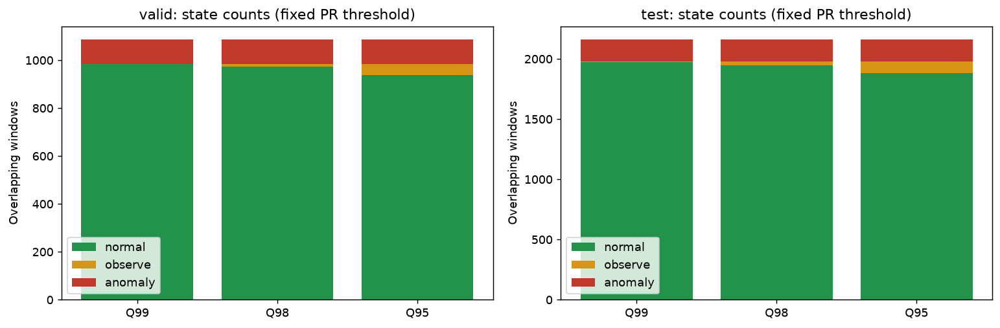
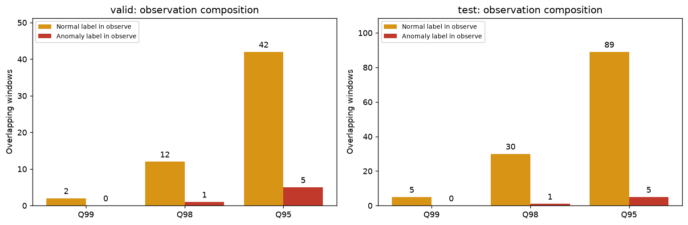

# 96 노트북 기반 건강점수와 급하락 경고 분석 보고서

작성일: 2026-10-06  
대상: [96_saved_threshold_health_scores.ipynb](../notebooks/analysis/96_saved_threshold_health_scores.ipynb)  

**공개 자료 안내:** 보고서의 수치와 노트북 출력은 기존 예시 실행의 결과다. 원 실행 데이터·평가 CSV는 이 저장소에 포함하지 않으므로 재현하려면 자신의 학습 실행 폴더가 필요하다.

## 1. 결론과 추천

사용 목적은 학습된 모델의 점수로 **정상·관찰·이상을 구분하고, 현재 상태가 정상이더라도 건강점수가 급격히 하락할 때 경고하는 것**이다. 이를 위해 현재 수준을 판단하는 상태 지표와 변화 속도를 판단하는 급하락 경고를 분리했다.

현재 데이터와 사용 목적에서는 **P=R 이상 경계 + 정상 Valid Q95 관찰 경계**를 우선 검토할 후보로 추천한다. 사용자에게는 정상 **50~100점**, 관찰 **45~49점**, 이상 **0~44점**을 표시한다. 관찰 표시 자체가 즉시 점검이나 출동을 유발한다면 정상 데이터의 관찰 부담이 더 작은 **Q98**을 대안으로 고려한다.

이 추천은 탐색적 운영안이다. 96 노트북의 기본 정책은 원 실험의 최대 F1 이상 경계와 Q99 관찰 경계를 유지하며, 추천안은 6절 비교 분석과 8절 사용자 안내 예시에서 별도로 실행된다. **Q95는 정상 점수의 95백분위이며, 건강 95점이나 고장 확률 95%를 뜻하지 않는다.**

## 2. 분석 데이터와 모델의 역할

선택 모델은 `best_normal_loss_epoch_0795.pt`이며 epoch는 **795**이다. 원 실험은 `01_baseline_lstm_raw / raw-standard / seed_42`이다. 96 노트북에서는 모델을 재학습하거나 추론하지 않고 저장된 평가 점수와 정책을 읽어 분석한다.

| 구분 | 정상 라벨 윈도우 | 이상 라벨 윈도우 | 전체 윈도우 |
|---|---:|---:|---:|
| Valid | 985 | 102 | 1,087 |
| Test | 1,988 | 174 | 2,162 |

이 수는 독립 고장 사건 수가 아니라 **서로 중첩된 윈도우 수**다. 정상·이상이 서로 다른 짧은 구간으로 구성되어 있으며, 정상에서 고장까지 이어지는 장기간 열화 이력은 없다. 평가 대상은 저장 설정의 `label_10s`지만, 이번 데이터에서 `label_current`와 값이 같다. 이름만으로 10초 선행 예측을 검증했다고 해석하면 안 된다.

모델은 센서 시계열의 복원을 학습하여 점수를 만든다. 경계값은 그 학습된 모델이 Valid에 출력한 점수 분포와 정답 라벨을 이용해 선택한다. 따라서 경계 조정은 학습을 무효화하는 것이 아니라 **같은 학습 결과를 어떤 운영 기준으로 판정할지 정하는 단계**다.

### 2.1 실제 판정에 사용한 score

이번 모델의 판정 점수는 **윈도우 마지막 시점에서 표준화된 3개 입력 채널의 복원 제곱오차를 평균한 값**이다. 저장 센서 점수의 가중치는 전류 1/3, 진동 2/3이다. 학습 중 표시되는 전체 윈도우 MSE LOSS와 집계 범위가 다르므로 원 score용 임계값을 전체 윈도우 LOSS에 바로 적용하면 안 된다.

노트북은 체크포인트·epoch·점수 정의·센서 가중합·윈도우 ID·라벨·시간을 검증한다. CSV는 경계 동점의 정밀도를 보존하도록 `float_precision='round_trip'`으로 읽는다.

## 3. 기준점의 정의

### 3.1 기본 정책과 추가 비교 정책

| 항목 | 원 실험을 보존하는 기본 정책 | 추가 비교 및 사용자 예시 |
|---|---|---|
| 이상 진입 | `score >= 0.33727604150772095` | `score >= 0.2432374209165573` |
| 이상 경계 근거 | Valid 최대 F1 저장 경계 | Valid에서 Precision=Recall인 저장 임계값 |
| 관찰 진입 | 정상 Valid Q99보다 큰 score | 정상 Valid Q99·Q98·Q95 비교 |
| 상태 우선순위 | 이상 → 관찰 → 정상 | 이상 → 관찰 → 정상 |
| 급하락 경고 | 상태와 독립 | 같은 기울기·기준·연속 조건 사용 |

저장된 `pr_equal` 정책의 연산자는 `>`다. 그러나 PR 곡선은 임계값과 같은 점수를 양성에 포함하는 `>=`를 사용한다. Valid에는 경계와 정확히 같은 정상 윈도우가 1개 있어 연산자에 따라 Precision이 달라진다. 추가 비교에서는 **저장 임계값은 사용하되 연산자를 `>=`로 변경**하여 Valid의 P=R을 맞췄다. 이는 원 저장 정책의 완전한 재현과 구분된다.

### 3.2 Q99와 Q98과 Q95

정상 Valid score에 `np.quantile(..., q, method='higher')`를 적용한다. Q99는 기존 저장 경계와 대조하고, Q98·Q95는 추가 분석에서 계산한다. 임계값 계산에 Test는 사용하지 않는다.

| 관찰 기준 | 관찰 score 경계 | 정상 | 관찰 | 이상 |
| --- | --- | --- | --- | --- |
| Q99 | 0.222636342049 | 46~100점 | 45~45점 | 0~44점 |
| Q98 | 0.170288056135 | 48~100점 | 45~47점 | 0~44점 |
| Q95 | 0.124975942075 | 50~100점 | 45~49점 | 0~44점 |

P=R 이상 경계를 T, 관찰 경계를 W라고 하면 판정은 다음과 같다.

```text
score >= T         → 이상
W < score < T      → 관찰
score <= W         → 정상
```

명목상 상위 1%·2%·5%와 실제 관찰 비율은 같지 않을 수 있다. 유한 표본의 분위수 계산, 동점, 이상 상태의 우선 판정이 함께 작용하기 때문이다.

## 4. 건강점수의 계산과 정수 표시

원 score를 먼저 로그 변환한 뒤 방향을 뒤집어 0~100의 표시 점수로 바꾼다.

```text
x = log10(score + 1e-12)
a = Valid 전체 x의 최솟값 = -4.007145125357
b = Valid 전체 x의 최댓값 = 2.124769504668
H = 100 × (b - x) / (b - a)
```

표시할 때는 0~100 범위로 제한하고 정수화한다. 상태는 원 score로 먼저 결정한 뒤 해당 상태의 정수 구간 안에 표시값을 맞춘다. 따라서 반올림 때문에 관찰을 정상으로 다시 판정하지 않는다. **급하락 속도는 제한하거나 반올림하기 전 H로 계산**한다.

현재 Q95의 정확한 건강 경계는 관찰 약 **49.3801점**, 이상 약 **44.6637점**이다. 사용자 표시 구간이 50~100점, 45~49점, 0~44점인 이유다. 기본 정책의 정수 범위인 정상 46~100점, 관찰 43~45점, 이상 0~42점과 혼동하지 않아야 한다.

건강 100점은 이번 Valid 범위에서 작은 복원 오차를 뜻하며 완전한 안전 보장은 아니다. 건강 0점도 즉시 고장이나 잔여 수명 0을 의미하지 않는다. 모델·전처리·데이터 분포가 바뀌면 같은 점수의 의미도 다시 검증해야 한다.

## 5. Q99와 Q98과 Q95 비교 결과

### 5.1 정상 관찰 이상 개수

다음 표는 P=R 이상 경계를 고정한 결과다.

| 데이터 | 관찰 기준 | 정상 | 관찰 | 이상 | 합계 |
| --- | --- | --- | --- | --- | --- |
| valid | Q99 | 983 | 2 | 102 | 1087 |
| test | Q99 | 1973 | 5 | 184 | 2162 |
| valid | Q98 | 972 | 13 | 102 | 1087 |
| test | Q98 | 1947 | 31 | 184 | 2162 |
| valid | Q95 | 938 | 47 | 102 | 1087 |
| test | Q95 | 1884 | 94 | 184 | 2162 |



관찰 경계를 낮출수록 정상에서 관찰로 이동하는 윈도우가 늘어난다. 이상 경계는 고정했으므로 이상 개수는 Valid 102개, Test 184개로 동일하다.

### 5.2 관찰로 분류되는 데이터의 구성

| 관찰 기준 | 실제 정상 중 관찰 | 실제 이상 중 관찰 | 실제 이상 중 정상 | 정상 중 관찰 비율 |
| --- | --- | --- | --- | --- |
| Q99 | 5 | 0 | 8 | 0.25% |
| Q98 | 30 | 1 | 7 | 1.51% |
| Q95 | 89 | 5 | 3 | 4.48% |



Test에서 Q95는 실제 이상 5개를 관찰로 표시하며, 실제 이상인데 정상으로 표시되는 수를 Q99의 8개에서 3개로 줄인다. 동시에 실제 정상 89개가 관찰로 표시되어 정상 중 관찰 비율은 4.48%가 된다. Q98은 실제 정상 30개와 실제 이상 1개를 관찰로 표시한다.

관찰이 한 번이라도 나타나는 정상 Test 세그먼트는 Q99 **4/90개**, Q98 **26/90개**, Q95 **49/90개**다. 따라서 Q95의 윈도우 비율이 4.48%라고 해서 사용자가 드물게 관찰을 보게 된다고 단정할 수는 없다. 세그먼트 역시 독립 고장 사건을 의미하지 않는다.

현재 실제 이상 세그먼트는 이미 모두 최소 한 번 이상 상태가 나타난다. 관찰 구간의 확대가 추가 고장 사건 탐지나 선행 탐지를 달성했다고 주장할 근거는 없다.

## 6. F1과 Precision 및 Recall 해석

### 6.1 이상 경계를 바꾸면 F1이 달라진다

| 데이터 | 이상 판정 정책 | FP | FN | TP | precision | recall | F1 |
| --- | --- | --- | --- | --- | --- | --- | --- |
| valid | 기본 최대 F1 | 1 | 9 | 93 | 0.9894 | 0.9118 | 0.9490 |
| valid | 저장 P=R 임계값과 > | 6 | 7 | 95 | 0.9406 | 0.9314 | 0.9360 |
| valid | 비교 P=R 임계값과 >= | 7 | 7 | 95 | 0.9314 | 0.9314 | 0.9314 |
| test | 기본 최대 F1 | 9 | 13 | 161 | 0.9471 | 0.9253 | 0.9360 |
| test | 저장 P=R 임계값과 > | 18 | 8 | 166 | 0.9022 | 0.9540 | 0.9274 |
| test | 비교 P=R 임계값과 >= | 18 | 8 | 166 | 0.9022 | 0.9540 | 0.9274 |

기본 최대 F1 경계에서 P=R 경계로 바꾸면 Test의 FN은 13개에서 8개로 줄지만 FP는 9개에서 18개로 늘어난다. Recall은 높아지고 Precision은 낮아지며, F1은 약 **0.9360 → 0.9274**로 감소한다. 따라서 P=R을 선택하는 이유는 최대 F1 달성 자체가 아니다. 동일 Valid에서 P=R은 FP=FN인 운영점이며, 잘못된 경고와 놓침의 비용이 같거나 총비용이 최소라는 뜻도 아니다.

P=R이 성립하는 데이터는 경계를 선택한 Valid다. Test에서 같은 경계를 사용했을 때 Precision과 Recall은 서로 다르다.

### 6.2 관찰 경계만 바꾸면 이상 판정 F1은 같다

P=R 이상 경계가 고정되면 Q99·Q98·Q95 모두 `이상만 양성`인 F1은 Valid **0.9314**, Test **0.9274**로 같다. 관찰은 사용자 상태 표시이고 이상 판정의 양성에 포함되지 않기 때문이다.

관찰도 양성으로 취급하면 다른 이진 정책이 되며 아래처럼 성능이 달라진다.

| 관찰 기준 | FP | FN | precision | recall | F1 |
| --- | --- | --- | --- | --- | --- |
| Q99 | 23 | 8 | 0.8783 | 0.9540 | 0.9146 |
| Q98 | 48 | 7 | 0.7767 | 0.9598 | 0.8586 |
| Q95 | 107 | 3 | 0.6151 | 0.9828 | 0.7566 |

넓은 관찰 구간은 이상 윈도우를 더 많이 포함하지만 정상 윈도우도 함께 포함한다. 정답 라벨은 정상과 이상의 두 종류뿐이므로 이 데이터로 정상·관찰·이상의 3-class F1을 계산하지 않는다.

## 7. 정상 상태에서도 가능한 급하락 경고

기울기는 최근 **1초의 과거와 현재 건강점수**에 Theil–Sen 추정을 적용해 구한다. 모든 점 쌍의 기울기 중앙값을 사용하며, 건강점수 하락이 양수가 되도록 부호를 반전한다. 설정상 최소 6점과 1초 전체 이력이 모두 필요하고, 0.1초 간격 데이터에서는 보통 11점이 필요하다. 구간 사이의 시간 간격이 0.15초를 넘으면 이력을 끊는다.

이번 정상 Valid의 유효 기울기 기준 표본은 **573개**다. 현재 기울기 이상인 정상 기준 표본 수를 이용해 `(1 + 해당 개수)/(N + 1)`의 상위 꼬리 비율을 계산한다.

| 구분 | 현재 설정과 실제 경계 |
|---|---|
| 하락 추세 관찰 | 양의 하락 속도이며 꼬리 비율 ≤ 5%, 현재 약 13.26점/초 초과 |
| 새 급하락 경고 | 양의 하락 속도이며 꼬리 비율 ≤ 1%를 2회 연속 만족, 현재 약 19.48점/초 초과 |
| 경고 유지 | 새 알림을 반복 전송하지 않고 활성 상태 유지 |
| 경고 해제 | 회복 또는 꼬리 비율 > 5% 등의 해제 조건을 2회 연속 만족 |
| 이력 부족 | 기울기를 0으로 간주하지 않고 계산 대기 표시, 진행 중 판단은 중단 |

여기의 **1%·5%는 기울기 분포에 대한 별도 설정**이다. 상태를 구분하는 Q95의 5%와 역할이 다르다. 또한 윈도우가 상관되어 있어 실제 현장 오경고 확률 1%를 보장하지 않는다. 이 설정은 원 모델에서 학습한 경계가 아닌 추가 감시 정책이다.

현재 `level_gate_tail=1.0`으로 정상 수준에서도 경고를 허용한다. Q99·Q98·Q95로 상태 플래그를 각각 바꾸어 경고 정책을 재실행했고 새 경고·유지·해제 결과가 같음을 확인했다.

| 데이터 | 새 급하락 경고 횟수 | 경고 활성 윈도우 수 |
| --- | --- | --- |
| test | 4 | 15 |
| valid | 2 | 13 |

정답 라벨별 발생 현황도 함께 봐야 한다. 아래 경고는 탐지 이벤트이며 실제 고장 발생을 뜻하지 않는다.

| 데이터 | 정답 라벨 0 정상 1 이상 | 새 경고 횟수 | 경고 활성 윈도우 |
| --- | --- | --- | --- |
| test | 0 | 2 | 3 |
| test | 1 | 2 | 12 |
| valid | 0 | 1 | 5 |
| valid | 1 | 1 | 8 |

## 8. 사용자에게 전달되는 실제 예시

96 노트북 마지막 절은 실제 데이터에서 각 상황을 골라 아래 문구를 생성한다. Test 사례를 우선 사용하며, Test에 없는 상황은 Valid 사례로 표시한다. 다음 건강점수와 속도는 사용자용 정수 표현이다.

**1. 정상 상태 (TEST)**

> 건강 57점 | 정상 (50~100점) | 건강점수 회복 약 2점/초 | 새 경고 없음

**2. 관찰 상태 (TEST)**

> 건강 47점 | 관찰 (45~49점) | 변화 속도 계산 대기 | 새 경고 없음

**3. 이상 상태 (TEST)**

> 건강 43점 | 이상 (0~44점) | 건강점수 하락 약 3점/초 | 새 경고 없음

**4. 정상이어도 급하락 새 경고 (TEST)**

> 건강 53점 | 정상 (50~100점) | 건강점수 하락 약 28점/초 | 새 경고: 건강점수가 급격히 하락했습니다. 설비 상태를 확인하세요.

**5. 관찰 중 급하락 새 경고 (VALID)**

> 건강 47점 | 관찰 (45~49점) | 건강점수 하락 약 26점/초 | 새 경고: 건강점수가 급격히 하락했습니다. 설비 상태를 확인하세요.

**6. 이상 중 급하락 새 경고 (TEST)**

> 건강 20점 | 이상 (0~44점) | 건강점수 하락 약 23점/초 | 새 경고: 건강점수가 급격히 하락했습니다. 설비 상태를 확인하세요.

**7. 경고 유지 (TEST)**

> 건강 14점 | 이상 (0~44점) | 건강점수 하락 약 24점/초 | 급하락 경고 유지 중

**8. 경고 해제 (TEST)**

> 건강 55점 | 정상 (50~100점) | 건강점수 하락 약 12점/초 | 급하락 경고 해제

**9. 속도 이력 부족 (TEST)**

> 건강 66점 | 정상 (50~100점) | 변화 속도 계산 대기 | 새 경고 없음

정상 상태의 급하락 경고는 상태를 강제로 이상으로 바꾸지 않는다. 반대로 이상 상태라도 급하락 조건이 없으면 상태만 이상으로 표시하고 새 급하락 경고는 보내지 않는다. 이는 사용자가 요청한 “가파른 경우만 경고” 정책이다. 경고가 해제되었다고 설비 이상 자체가 해소되었다는 뜻은 아니다.

분석용 표에는 윈도우 ID·시간·정답 라벨·원 score·반올림 전 기울기를 남긴다. 사용자 문구에는 정답 라벨을 사용하지 않는다. 실제 한 구간의 시계열 출력도 함께 제공해 이력 수집, 새 경고, 유지, 해제 흐름을 확인할 수 있게 했다. 노트북은 메시지를 출력할 뿐 외부 알림을 실제 발송하지 않는다.

## 9. 적용 판단과 추가 검증

**관찰은 화면 표시이고 경고는 급하락에만 내보낼 때 Q95**가 목적에 가장 잘 맞는 현재 후보다. **관찰마다 사람이 조사해야 한다면 Q98**이 관찰 부담을 줄이는 선택이다. Q99는 현재 P=R 경계와 가까워 관찰 단계가 매우 좁다.

수치 경계는 Valid에서만 계산했지만, 후보 추천에는 이미 확인한 Test 결과가 반영됐다. 따라서 추천안에 대해 같은 Test를 새로운 독립 검증 결과처럼 보고하면 안 된다. 실제 운영안 확정 전에는 새로운 기간 또는 설비 자료에서 다음 항목을 확인해야 한다.

1. 시간당 또는 일당 불필요한 경고 횟수와 경고 지속시간.
2. 실제 고장 사건별 탐지 여부와 첫 경고부터 고장까지의 선행시간.
3. 관찰 표시가 한 번이라도 발생하는 운전 구간 비율과 점검 업무량.
4. 운전 조건 변화에 따른 점수·기울기 분포 변화와 기준 재설정 필요성.

## 10. 연구 근거와 이번 설계의 구분

- **복원 오차 기반 건강지표:** Malhotra 등은 정상 시계열을 복원하는 LSTM Encoder-Decoder와 복원 오차 기반 HI를 제안했다. 이 원리는 현재 분석의 근거다. 다만 이번 로그 변환, Valid 범위 앵커, 정수 상태 구간 및 Q95 선택은 해당 논문을 그대로 재현한 공식이 아니라 이 실험의 설계다. [Malhotra et al., 2016](https://arxiv.org/html/1608.06154)
- **점수와 판정 경계의 분리:** 모델의 점수를 유지하면서 목적에 맞는 경계를 선택할 수 있으며, 임계값 조정에는 적절한 검증이 필요하다. 이는 경계 변경으로 모델 학습이 무의미해지지 않는 이유를 설명한다. [scikit-learn 임계값 조정 문서](https://scikit-learn.org/stable/modules/classification_threshold.html)
- **강건한 기울기 추정:** Theil–Sen은 점 쌍 기울기의 중앙값을 이용하는 방법이다. 이를 건강점수 변화 속도에 적용했다. 최근 1초, 꼬리 비율 1%·5%, 2회 연속 조건은 이번 분석의 운영 설정이며 논문이 보장한 최적값이 아니다. [SciPy theilslopes 문서](https://docs.scipy.org/doc/scipy/reference/generated/scipy.stats.theilslopes.html)

## 11. 코드와 재현 결과

96 노트북의 6절은 Q별 경계·상태 개수·성능·관찰 부담·경고 독립성을 계산하고, 8절은 Q95 사용자 문구와 실제 시간 순서를 출력한다. `Run All`로 전체 결과를 재생성할 수 있다. `WRITE_OUTPUTS=True`이면 각 실행 폴더에 비교 CSV와 사용자 예시를 저장한다.

- 주요 비교 함수: `observation_quantile_comparison`
- 사용자 안내 함수: `q95_user_message`
- 비교 자료: `comparison_states.csv`, `comparison_metrics.csv`, `comparison_integer_ranges.csv`, `comparison_segments.csv`, `comparison_alarms.csv`
- 사용자 예시: `q95_user_examples.csv`, `q95_user_timeline.csv`, `q95_user_windows.csv.gz`
- 출처 추적: `rules.json`, `comparison_rules.json`, `provenance.json`

전체 노트북 실행을 완료했고 원 예측 불일치는 **0개**, 원 F1과의 최대 차이는 **0.0**이었다. 경계 동점, Test를 변경해도 Valid 경계가 바뀌지 않는지, 정상 상태에서의 경고, 정수 표시의 상태 보존 등을 검증하는 기존 테스트 **6개가 통과**했다. 이는 코드의 일관성 확인이며 현장 예지보전 성능 검증을 대신하지 않는다.

재현 방법: 학습 완료 실행 폴더를 별도로 준비하여 노트북의 `RUN_PATH`에 지정한다. 분석 결과는 해당 실행 폴더의 `threshold_health_analysis96/` 아래 새 실행 폴더에 저장된다. 개인 실행 경로·실행 폴더 ID는 공개본에서 제외했다.
