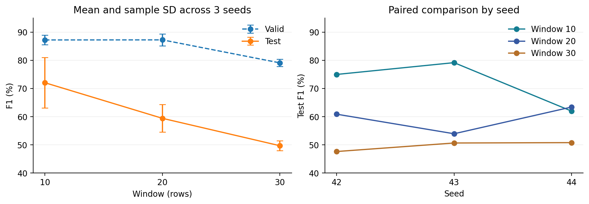

Window 크기 비교 실험
결과 분석 보고서

실험 ID: window_compare_02 | 분석일: 2026-09-28 | Window 10 / 20 / 30 × Seed 42 / 43 / 44

1. 핵심 결론

**관측된 Test 평균 F1은 window 10이 가장 높았다.** Window 20 대비 12.63%p 높고, 정상 오경보율은 2.28%에서 1.22%로 낮았다. 다만 seed별 변동이 커서 세 seed 모두에서 우세하지는 않았다.

**사전에 정한 선택 규칙의 결과는 window 20이다.** 평균 Valid F1이 87.270%로 window 10의 87.243%보다 0.027%p 높아 selection.json에 20이 저장됐다. 이 차이는 seed 변동보다 훨씬 작으므로 20의 확실한 우위로 해석하기 어렵다.

| 지표 (%, 평균 ± 표준편차) | Window 10 | Window 20 | Window 30 |
| --- | --- | --- | --- |
| Valid F1 | 87.24 ± 1.73 | 87.27 ± 2.10 | 79.11 ± 1.25 |
| Test F1 | 72.06 ± 8.97 | 59.43 ± 4.91 | 49.71 ± 1.79 |
| Test Precision | 66.32 ± 16.01 | 47.45 ± 4.49 | 36.98 ± 1.88 |
| Test Recall | 81.19 ± 3.43 | 79.54 ± 4.98 | 75.91 ± 2.06 |
| Test 정상 오경보율 | 1.22 ± 0.89 | 2.28 ± 0.28 | 3.34 ± 0.28 |
| Test AP | 83.16 ± 1.67 | 77.05 ± 5.85 | 70.77 ± 1.28 |

표준편차는 seed 3회에 대한 표본 표준편차(ddof=1)다. AP는 Average Precision이며, 여기서는 PR-AUC의 사다리꼴 적분값과 구분한다. 정상 오경보율은 FP / 정상 표본 수다.

실무 판단: 10과 20을 후속 검증 후보로 유지하고, 30은 이번 조건에서 우선순위를 낮춘다. Test를 이미 확인했으므로 10을 최종 선택하려면 새로운 독립 평가 데이터가 필요하다.

---

2. 실험 조건과 비교의 공정성

| 항목 | 확인한 설정 |
| --- | --- |
| 모델 | LSTM Autoencoder: 64 → 32 → 반복 → 32 → 64 → 출력 3채널 |
| 입력 / 전처리 | 진동 2채널 + 전류 1채널, 절댓값, 정상 학습 구간으로 MinMaxScaler fit |
| 실험 조건 | Window 10 / 20 / 30, 각 seed 42 / 43 / 44, ALIGN_WINDOW=50 |
| 학습 | 최대 800 epoch, batch 128, learning rate 0.001, lr factor 0.7 / patience 50 |
| 조기 종료 / 복원 | 정상 Valid MSE 기준, min_delta=0.00001, patience=120. 개선 기준으로 저장한 가중치 복원 |
| 점수 / 임계값 | 마지막 시점의 3채널 재구성 MSE. Valid F1 최대 임계값, score >= threshold면 이상 |
| 실행 환경 | Python 3.9.7, PyTorch 2.7.0+cu126, CUDA 12.6, Tesla T4 |
| 분석 환경과 실행 구분 | 기존 실행 산출물을 검산했다. 이번 보고서 작성 중 모델을 재학습하지 않았다. |

| 분할 | 정상 | 이상 | 합계 |
| --- | --- | --- | --- |
| Train | 14,850 | 0 | 14,850 |
| Valid | 880 | 300 | 1,180 |
| Test | 3,921 | 101 | 4,022 |

Window가 달라도 입력의 마지막 행과 라벨 행을 동일하게 맞췄다. 각 후보는 같은 시점을 평가하고, 긴 window만 더 오래된 입력을 추가로 본다. 경계에서 anchor-1=49개 후보를 제외하여 Valid/Test 입력 행이 겹치지 않게 했다.

label_offset=100은 원본 인덱스 규칙상 입력 마지막 행보다 101행 뒤의 라벨을 사용한다. 입력 경계 중복은 제거했지만, 미래 라벨 시점까지 완전히 분리한 forecasting 검증을 의미하지는 않는다.

검산 결과

9개 config와 학습 이력, 예측 CSV의 F1·Precision·Recall·AP·ROC-AUC·혼동행렬, summary.csv의 평균·표준편차를 재계산해 확인했다. 모든 실험의 평가 시점·라벨·표본 수가 같고 Valid/Test 입력 경계가 분리됨을 확인했다. 예측 CSV의 점수 반올림은 임계값과 같은 점수에서 허용 오차로 처리했다.

원본 가이드의 window 20 실험과는 분할·임계값 규칙·가중치 복원 방식이 다르다. 따라서 이번 세 후보끼리 비교해야 하며 기존 가이드 수치와 직접 우열을 판단하면 안 된다.

---

3. Seed별 결과와 비용

| Window | Seed | Valid F1 % | Test F1 % | FP | FN | 실행/선택 epoch | 학습 분 |
| --- | --- | --- | --- | --- | --- | --- | --- |
| 10 | 42 | 85.31 | 75.00 | 39 | 17 | 800 / 699 | 13.13 |
| 10 | 43 | 87.74 | 79.19 | 18 | 23 | 717 / 597 | 12.04 |
| 10 | 44 | 88.67 | 61.99 | 86 | 17 | 800 / 789 | 12.98 |
| 20 | 42 | 89.38 | 60.90 | 84 | 20 | 800 / 744 | 13.14 |
| 20 | 43 | 85.18 | 53.96 | 102 | 26 | 800 / 763 | 12.98 |
| 20 | 44 | 87.25 | 63.43 | 82 | 16 | 800 / 747 | 12.97 |
| 30 | 42 | 78.16 | 47.65 | 142 | 25 | 617 / 497 | 10.04 |
| 30 | 43 | 78.64 | 50.68 | 120 | 26 | 556 / 436 | 9.01 |
| 30 | 44 | 80.53 | 50.80 | 131 | 22 | 471 / 351 | 7.72 |

FP: 정상 3,921개 중 이상으로 판정한 개수. FN: 이상 101개 중 놓친 개수. 실행/선택 epoch는 실제 학습 횟수와 최종 복원 가중치의 epoch(1부터 시작)를 뜻한다.

10과 20의 차이는 얼마나 일관적인가?

같은 seed끼리 비교한 Test F1 차이(10 - 20)는 seed 42에서 +14.10%p, seed 43에서 +25.23%p, seed 44에서 -1.44%p였다. 평균은 +12.63%p지만 3회 중 2회만 10이 우세했다. 통계적으로 유의한 우위라고 단정하지 않는다.

Window 10의 평균 FP는 47.7개로 20의 89.3개보다 41.7개 적었다(46.6% 감소). 평균 FN은 19.0개 대 20.7개로 차이가 작았다. F1 개선은 주로 오경보 감소와 Precision 상승에 연결된다. 10의 seed 44에서는 FP가 86개로 늘어 F1이 61.99%까지 낮아졌다.

| 항목 | Window 10 | Window 20 | Window 30 |
| --- | --- | --- | --- |
| 평균 학습시간 (분) | 12.72 | 13.03 | 8.92 |
| 평균 실행 epoch | 772.3 | 800.0 | 548.0 |
| 조기 종료 횟수 / 3 | 1 / 3 | 0 / 3 | 3 / 3 |
| GPU peak allocated (MiB) | 87.6 | 100.5 | 113.3 |

9회 학습시간 합계는 104.01분이다. 설치·전처리·평가·다운로드 시간은 포함하지 않는다. Window 30의 짧은 학습시간은 적은 epoch에서 조기 종료된 결과이므로, 길이 30 자체의 연산이 더 빠르다는 뜻은 아니다. GPU 값은 PyTorch의 peak allocated 메모리이며 장치 전체 사용량이 아니다.

---

4. 해석의 한계와 다음 실험

**Valid와 Test의 구성 차이.** 이상 비율은 Valid 25.42%, Test 2.51%다. 오경보율이 같더라도 이상 비율이 낮으면 Precision과 F1이 낮아질 수 있다. 두 구간의 시점 차이도 있으므로 성능 하락을 과적합 하나로 설명할 수 없다. Test를 전부 정상으로 예측해도 Accuracy가 97.49%이므로 Accuracy만으로 판단하지 않는다.

**작은 Valid 차이와 모델 선택.** 자동 선택은 20이지만, 10의 Valid AP는 95.15%로 20의 93.97%보다 높다. 이는 다른 지표의 관측 결과이며 사전 F1 규칙을 사후에 바꿔 10의 승리를 선언할 근거는 아니다. 이번 결과는 후속 검증에서 10과 20을 비교할 근거로 사용한다.

**학습 손실은 최종 탐지 성능과 다르다.** Train/Valid MSE는 window 전체를 평균하지만 탐지 점수는 마지막 시점만 사용한다. window별 best_val_mse나 임계값의 크기 자체로 분류 성능을 순위 매기지 않는다. 또한 best_val_mse는 이력의 단순 최솟값이고, 선택 가중치는 min_delta 기준이므로 서로 다른 epoch일 수 있다.

**표본 독립성과 범위.** Test 이상 101개는 겹치는 window이므로 독립 고장 사건 101개가 아니다. Seed 표준편차는 학습 초기화 등의 변동만 반영한다. 정상/이상 CSV가 각각 단일 라벨인 구조여서 고장 전환 이전의 조기 경보 시간은 입증하지 못한다. 이번 관측만으로 통계적 유의성이나 새 설비 일반화를 주장하지 않는다.

후속 실행 권고

| 우선순위 | 실행 내용 |
| --- | --- |
| 1. 결과 고정 | 현재 실행을 기준 실험으로 보관한다. 공식 선택 20과 관측 Test 최고 10을 함께 기록한다. |
| 2. 재검증 데이터 | 가능하면 다른 날짜·설비·고장 사건을 새 최종 평가셋으로 확보한다. 지금 Test는 후속 개발 결과의 독립 검증으로 재사용하지 않는다. |
| 3. 후보 좁히기 | 개발용 검증 데이터에서 10 / 15 / 20을 우선 비교한다. ALIGN_WINDOW=50과 전처리·분할·학습 규칙은 유지한다. |
| 4. 변동성 확인 | 동일한 seed 목록을 최소 5개로 늘려 비교한다. 20은 모두 800 epoch에 도달했으므로 학습 상한 영향도 별도의 동일 조건 실험으로 검토한다. |
| 5. 운영 기준 | 허용 오경보율과 필요한 Recall을 먼저 정하고, 그 기준의 임계값을 개발 데이터에서 선정한 뒤 새 평가셋에 한 번 적용한다. |

자료와 재현 범위

분석 자료: window_compare_02의 experiment.json, runs.csv, summary.csv, selection.json 및 9개 하위 폴더의 config.json, training.json, history.csv, split_manifest.csv, valid/test_predictions.csv. 결과는 제출된 실행 산출물에 근거한다.

실제 실행한 노트북 사본과 당시 코드 커밋은 결과 폴더에 없다. 배포 묶음에는 이전에 제공한 노트북을 저장 설정에 맞춰 구성한 참고본을 포함한다. 실행 소스가 완전히 같았는지는 확인하지 못했다. 모델 가중치 및 입력 CSV의 실제 내용에 대한 재학습 검증은 수행하지 않았다.